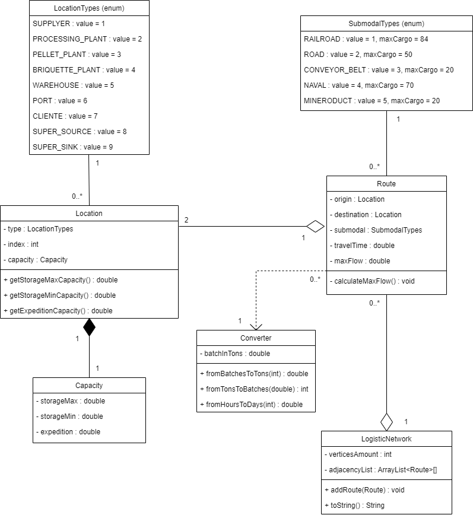

# Diagrama de Classes

&emsp;Diagramas de classe são uma ferramenta para mapear um sistema de forma simples e explícita através da modelagem das entidades (classes) que nele atuam, seus atributos, operações e relações entre objetos. Por isso, eles ajudam tanto no planejamento e construção do sistema quanto na sua manutenibilidade e crescimento, pois simplificam entendimento do seu funcionamento geral. [[1]](#ref1)

&emsp;Com o fito de estruturar a relação entre as diferentes classes e os respectivos objetos gerados a partir delas neste projeto, construiu-se um diagrama visual e descritivo que expõe quais são as classes implementadas inicialmente no desenvolvimento, suas propriedades e seus métodos (figura 01).

Figura 01: Diagrama de Classes

Fonte: Material produzido pelos autores (2024)

&emsp;Haja vista o objetivo de abordar a problemática apresentada pela Vale, empresa parceira deste projeto, sob a perspectiva matemática da teoria dos grafos, o diagrama acima foi montado visando a adequação a uma estrutura de representação de grafos em código. Logo, buscou-se modelar classes análogas a elementos presentes nesses objetos matemáticos, mas que também expressassem uma abstração da realidade do problema enfrentado. Neste aspecto, são equivalentes: "LogisticNetwork" (malha logística da Vale) e um grafo, "Route" (rota) e uma aresta, "Location" (localidade, como minas, entrepostos e portos) e um nó ou vértice.

&emsp;Para fins de detalhamento de funcionalidades e relações entre objetos, são explicadas individualmente abaixo as classes apresentadas no diagrama. É importante mencionar que todas foram implementadas com *getters* e *setters* (métodos de acesso ou escrita), que não foram explicitados na imagem do diagrama para não poluí-la com excesso de informações.

&emsp;***LocationTypes*:** classe do tipo *enumerable* com função de declarar os diferentes tipos possíveis de localidades, ou seja, nós do grafo, de forma eficiente. Essa informação, a princípio, é relevante para depuração, testes e visualização de resultados apenas.

&emsp;***SubmodalTypes*:** de maneira similar a anterior, esta é uma classe do tipo *enumerable* que declara os diferentes tipos possíveis de submodais de transporte, além de suas capacidades máximas de carga (inicialmente, em lotes, medida usada pela própria Vale com equivalência em toneladas). Logo, além de depuração, testes e visualização de resultados, esses valores também entrarão nos cálculos de fluxo realizados nos algoritmos escolhidos para a solução.

&emsp;***Location*:** classe que representa um nó ou vértice no grafo final, ou um determinado local na malha logística da Vale. Possui um tipo (*LocationTypes*), um índice referente à seu índice na lista de adjacência do grafo (que também funciona como identificador único do nó ou objeto), um objeto do tipo *Capacity*, que contém os dados de capacidades da localidade, e métodos para acessar os dados deste objeto.

&emsp;***Capacity*:** guarda valores referentes a características de capacidade de cada localidade, como capacidades máxima e mínima de estocagem e capacidade de expedição.

&emsp;***Route*:** classe que representa uma aresta no grafo final, ou uma rota entre duas localidades na malha logística da Vale. Logo, possui um nó de origem e um de destino, um tipo de submodal (*SubmodalTypes*), um tempo de travessia (expresso, inicialmente, em dias ou fração de dia) e um fluxo máximo permitido. Este último é calculado por um método da classe através da comparação entre as capacidades de expedição e estocagem dos nós de origem e destino, além da capacidade máxima de carga do submodal.

&emsp;***LogisticNetwork*:** classe que representa o grafo final, ou a malha logística da Vale. Possui uma propriedade que diz o número de vértices presentes no grafo para que a lista de adjacência possa ser apropriadamente inicializada e manipulada. Além disso, possui um método "toString" (conversão para formato "string") utilizado principalmente para depuração e testes.

&emsp;***Converter*:** classe estática que funciona como conversor de valores. É capaz de converter lotes para toneladas, realizar a operação inversa e transformar uma quantidade de horas em fração de dias. É utilizada pela classe "Route" e provavelmente será também no algoritmo e na apresentação de resultados finais.

&emsp;Em suma, o diagrama de classes estruturado para esse projeto não só permitiu uma robustez maior no planejamento da implementação técnica que foi realizada, mas também revela de forma clara e simples as relações existentes no sistema desenvolvido e seu processo de funcionamento para aqueles que forem continuar este trabalho em uma possível aplicação real da solução no ambiente da Vale. Dessa forma, corrobora-se o valor agregado no uso dessa ferramenta para o progresso ao resultado final produzido pelo grupo JaVale.

# Referências Bibliográficas

[1]: IBM. **Diagramas de Classes.** *Rational Software Architect Standard Edition*. 05 mar. 2021. Disponível em: <a name="ref1">https://www.ibm.com/docs/pt-br/rsas/7.5.0?topic=structure-class-diagrams</a>. Acesso em: 28 fev. 2023.