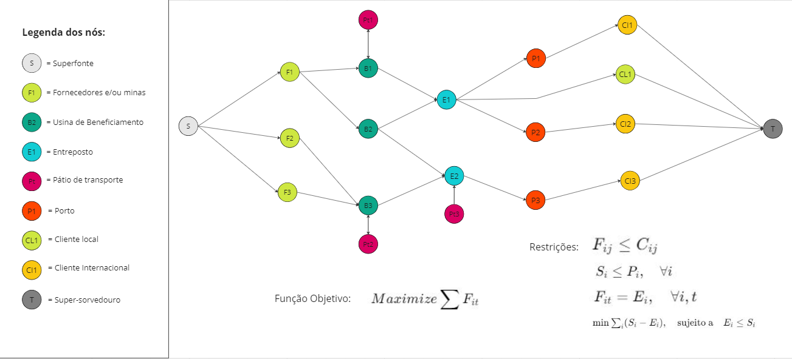
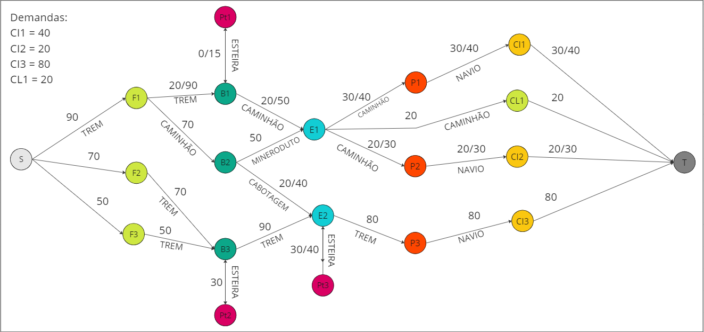
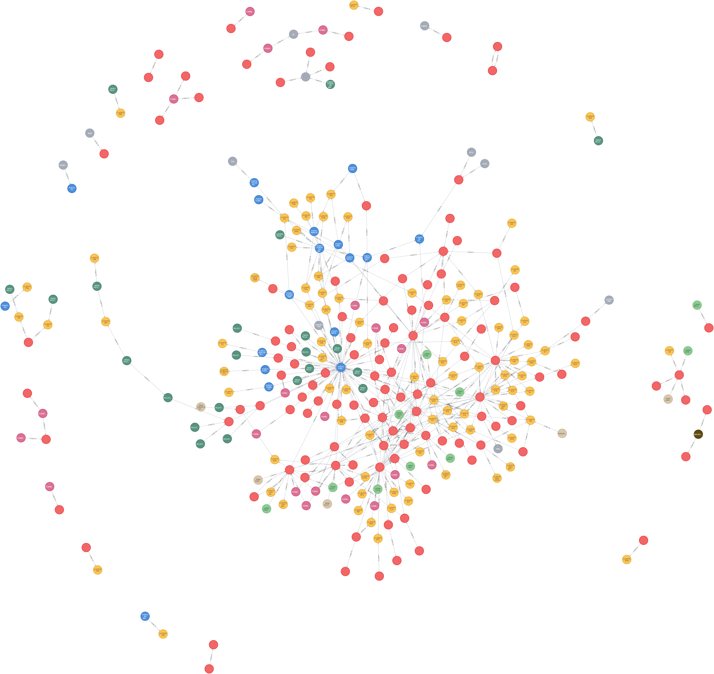

# Entendimento do contexto do problema: modelagem e representação

&emsp; “Entende-se a modelagem matemática como sendo um conjunto de etapas que tem como objetivo final fornecer uma descrição matemática de um dado fenômeno do mundo real.”(Unirio, 2012)[1](#ref1) Realizar a modelagem e a representação matemática envolve muito mais que o cálculo: é necessário um profundo entendimento acerca do processo que se deseja modelar e suas nuances, assim como uma definição consistente do objetivo em vista e das restrições do problema. Dessa forma, para atingir a compreensão e o sucesso ao desenvolver um projeto como este em questão, em que existe um forte viés matemático envolvido, é fundamental contar com uma boa modelagem e uma representação precisa do problema. 

&emsp; A questão apresentada pela Vale se relaciona com as etapas mencionadas anteriormente. Garantir um bom fluxo de transporte de minérios é o *core* (principal) da solução que a companhia espera e, para isso, é necessário realizar tanto a modelagem matemática quanto a compreensão de contexto, dados e objetivo do problema, além da representação visual do mesmo, esboçando os grafos e os dados que serão utilizados. Logo, nas seções a seguir, são definidas a modelagem matemática, a representação visual simplificada do sistema e a abordagem contextual que o grupo JaVale adotou para resolução da problemática apresentada pela empresa parceira.

## 1. Modelagem do problema

&emsp;Nas subseções seguintes, são apresentadas em detalhes as etapas percorridas para a modelagem do problema e ideação inicial de solução, que incluem o entendimento do problema por um viés matemático, a análise dos dados disponíveis, a definição de um objetivo para o algoritmo desenvolvido e o estabelecimento das devidas restrições para adequar a solução ao cenário real do problema. 

### 1.1. Qual é o contexto do problema a ser resolvido

&emsp;A questão central deste problema é a gestão eficiente dos fluxos de minério para atender à demanda dos clientes. O desafio envolve planejar os fluxos desde a extração até o cliente final, considerando a capacidade de cada porto, as particularidades de cada modal de transporte presente na malha logística da Vale e o tempo de transporte em cada ponto, de modo a enviar o máximo possível de minério para atender a demanda dos clientes.

&emsp;O problema se caracteriza como uma rede de fluxo máximo, ou seja, um grafo orientado em que cada aresta tem uma determinada capacidade de expedição. Ele contém também pontos intermediários como os entrepostos localizados entre as usinas de beneficiamento, pátios de estocagem, minas e fornecedores (pontos de origem) e portos ou clientes locais (pontos de destino). Também temos uma fonte no início do grafo e um superservidouro ao final, para auxiliar na modelagem do problema de fluxo máximo. Os clientes internacionais estão presentes nos dados e serão usados na representação dos grafos, porém não serão considerados na modelagem e otimização do problema.

### 1.2. Quais os dados disponíveis

&emsp; Os dados pertinentes incluem informações sobre o minério manipulado pela empresa, características e capacidades dos diferentes modais de transporte, demandas dos clientes, custos associados ao transporte e localidades relevantes, como as minas, os entrepostos e os portos por onde passam as cargas transportadas. Ademais, é importante ressaltar que a qualidade do minério e os custos operacionais de transporte, embora relevante para os negócios da Vale e possivelmente para a construção de uma solução robusta, não são considerados nesta fase do projeto de desenvolvimento de um MVP ("minimal viable product", ou produto mínimo viável), a fim de simplificar e baratear a solução neste estágio inicial.

&emsp;Tendo em vista o contexto do projeto, esses dados devem ser modelados como grafos em uma base de dados no *software* Neo4j, próprio para modelagem de dados em grafos. Neste contexto, os nós dos grafos são as localidades supracitadas e as arestas são os caminhos entre elas.

### 1.3. Qual o objetivo da solução

&emsp;Tratando-se de um problema de rede de fluxo máximo e dada a meta da Vale de foco no volume a ser enviado, o objetivo é maximizar a eficiência dos fluxos de minério produzidos pelas usinas de beneficiamento que chegam aos clientes, representados pela variável $F_{it}$, tendo um ponto de destino $t$, sendo o super-sorvedouro e  um ponto $i$, sendo qualquer nó final conectado a $t$ por uma aresta e diferente da superfonte, dentro de um conjunto de restrições operacionais. Matematicamente, isso pode ser expresso como:

$$Maximize \sum_{} F_{it} \quad\text{sendo i qualquer nó final conectado a t e t sendo o super-sorvedouro}$$ 

&emsp;Na equação acima, os fluxos de minérios recebidos ($F_{it}$) se referem na verdade a um conjunto de variáveis que seguem restrições no algoritmo desenvolvido, como as capacidades de produção e a produção real das usinas de beneficiamento, a capacidade de carga dos modais envolvidos no transporte, a capacidade de expedição dos pontos entre a superfonte $s$ e o super-sorvedouro $t$, a capacidade de armazenamento em pátios intermediários e a capacidade de estocagem especificamente dos pontos entre $s$ e $t$ que não são referentes às minas, dado que elas não possuem, em sua maioria, qualquer estoque.

&emsp;Por fim, é crucial ter em vista que, neste estágio inicial da solução, o tempo de transporte e os custos não estão sendo considerados na função objetivo, pois significaria uma dimensão a mais no grafo e aumentaria consideravelmente a complexidade do problema. Entretanto, é possível que esta variável seja incluída conforme o desenvolvimento do projeto caminhe de maneira proveitosa.

### 1.4. Qual é a tomada de decisão da solução proposta

&emsp;Haja vista o objetivo supramencionado de maximização da eficiência dos fluxos de escoamento de produção da Vale, a solução desenvolvida precisa ser capaz de indicar qual conjunto de fluxos e caminhos é mais adequado para levar os minérios da usina de beneficiamento até o porto e/ou os clientes locais, ou seja, qual rotas atendem à demanda de determinado cliente de forma otimizada e eficiente (maior quantidade de material chegando aos clientes no menor tempo). Dessa forma, é possível afirmar que as variáveis de decisão são justamente os fluxos de minérios (em toneladas) a serem transportados por cada aresta do grafo e quais arestas serão percorridas a fim de chegar ao destino, expresso por $F_{it}$ na equação acima (subseção 1.3.).

### 1.5. Limitações existentes

&emsp;As limitações ou restrições são condições impostas ao algoritmo para que as saídas geradas se mantenham factíveis e condizentes com a realidade do problema.

&emsp;Por exemplo, no contexto deste projeto, uma restrição crítica é a incapacidade de estocagem das usinas de beneficiamento; logo, o minério deve ser imediatamente enviado aos portos e entrepostos que possuem capacidade de armazenamento. As restrições de capacidade podem ser expressas como:

- $F_{jk} \leq C_{jk}$

&emsp;sendo:

- $j$ e $k$: quaisquer pontos de origem e destino
- $C_{jk}$ : capacidade da conexão;

&emsp;Essa restrição refere-se a capacidade máxima de minério que pode ser transportado em um determinado período entre dois pontos, seja entre minas e entrepostos, portos ou portos e clientes. Ela está sujeita também às capacidades de cada modal e assegura que o fluxo de minério $F_{it}$ que o algoritmo desenvolvido calcula para enviar pela conexão entre o ponto $i$ e o ponto $t$ não exceda a capacidade física ou operacional do arco.

&emsp;Outra restrição muito importante seria de que todo o fluxo que chega em um nó deve ser expedido, mesmo que ele possa temporariamente armazenar uma quantidade de material em um pátio. Isso está sujeito também a possibilidade e capacidade de estocagem de um ponto, além de o algoritmo também ter de ser capaz de preferenciar a saida de material que está em pátios para o sistema para que os mesmo não fiquem parados e acabem se desgastando. Ela pode ser representada por:

- $F_{jk} = E_{j}, \quad \forall j,k$ (Restrição de que todo o fluxo que chega em um nó deve ser expedido);

- $S_{j} \leq P_{j}, \quad \forall j$ (Restrição de capacidade máxima de estocagem dos pátios);

- $\min \sum_{i} (S_{j} - E_{j}), \quad \text{sujeito a} \quad E_{j} \leq S_{j}$ (Restrição de que o valor expedido deve ser sempre igual ou menor do que o armazenado em um nó, e sempre com valor de $S_{j}$ tendendo a 0, para remover o estoque );
  
&emsp;Sendo:

- $F_{jk}$ o fluxo de material do nó $j$ para o nó $k$;
- $S_{j}$ a quantidade de material armazenada temporariamente no pátio do nó $j$;
- $P_{j}$ a capacidade máxima de estocagem do pátio do nó $j$;
- $E_{j}$ a quantidade de material expedido do nó $j$ para fora do sistema;

&emsp;Portanto, são definidas quatro restrições diferentes para o problema: opção de modal de transporte em cada arco, capacidade de expedição (quantidade de carregamentos que podem ser feitos diariamente) e estocagem de cada nó, balanceamento de fluxos (a quantidade que chega a um nó precisa ser menor ou igual à sua capacidade de expedição mais sua capacidade de estocagem) e a restrição temporal inerente aos transportes (uma carga não pode ir de um ponto a outro instantaneamente, pois este tempo depende da velocidade do modal e da distância entre os pontos de origem e destino).

### 1.6. Representação visual simplificada

&emsp;Com o fito de adicionar mais uma camada de contextualização à modelagem matemática construída, montou-se uma representação visual simplificada do problema (figura 01), com um grafo que não condiz com a realidade ou mesmo com o grafo final da solução, apenas busca simular um cenário de menor escala como exemplo.

Figura 01: Exemplo de rede de fluxo máximo

Fonte: Material produzido pelos autores (2024)

&emsp;Na representação acima, podemos verificar diversos nós como as minas e fornecedores, usinas de benecificamento, pátios de transporte, entrepostos, portos e clientes locais e internacionais. Dado esse contexto, as arestas representam os caminhos possíveis existentes, onde cada um deverá receber um modal de transporte. O sistema é conectado por uma superfonte e um super-sorvedouro, utilizados para realizar os cálculos do fluxo máximo.

### 1.7. Solução viável

&emsp;Como solução para a otimização do fluxo dos minérios da Vale para garantir o envio de maior fluxo possível, temos a seguinte representação simplificada:

Figura 02: Exemplo factível de grafo de fluxo máximo

Fonte: Material produzido pelos autores (2024)

&emsp;Nela, podemos observar uma situação de fluxo de minérios na malha de transportes, onde o máximo de minério deve ser enviado aos clientes internacionais e/ou nacionais. Contudo, podem haver situações onde a produção de minério ultrapassa a demanda, exigindo assim o uso dos pátios de armazenamento para suprir a demanda de chegada de mínerio. Dessa forma, os pátios são utilizados para armazenar o excedente e enviar o que for possível, para posteriormente fazer o envio desse material sobressalente, além de os pátios não serem utilizados quando não há necessidade(como podemos observar no pátio Pt1).Observamos também situações que materiais são enviados abaixo da capacidade do modal daquela rota, de forma a otimizar o envio pelas melhores rotas favorecendo o fluxo, juntamente a situação do envio de E1 para P1 e P2, onde, por mais que uma quantia maior de material pudesse ser enviada para P2, isso não aconteceu, pois a demanda de seu cliente era menor do que a de P1. Também é possível verificar quais são os submodais utilizados em cada aresta do grafo. Dessa forma, é possível que a maior quantidade de materias seja enviado e ao mesmo tempo tratar os excessos e demandas, de forma a encontrar uma solução melhor para o problema.

&emsp;Por fim, também temos a representação das conexões reais da malha de transportes da Vale, dada pela imagem:

Figura 03: Exemplo de grafo com dados reais

Fonte: Material produzido pelos autores (2024)

&emsp; No grafo, ainda estão presentes apenas os nodes que representam cada localidade e as suas conexões, ainda sem especificações de modais de transporte entre outras coisas. Nela, temos:

- Em vermelho: Pátios de estocagem;
- Em azul: Portos;
- Em amarelo: Clientes;
- Em verde: Usinas de pelotagem;
- Em verde claro: Usinas de beneficiamento;
- Em marrom: Usinas de britamento;
- Em rosa: Fornecedores.

&emsp;Na estrutura dos dados, ainda deve-se validar o que são os nodes não classificados ou com classificações distintas nos dados e o que são os nodes que não se conectam a cadeia geral.Os grafos separados da cadeia principal tanbém serão esclarecidos junto ao parceiro.

## 2. Seleção de Algoritmos

&emsp;Um algoritmo eficaz não apenas otimiza a eficiência operacional, reduzindo custos e tempos de entrega, mas também amplia a capacidade de resposta da organização frente às dinâmicas do mercado e às demandas variáveis dos clientes. Ele serve como um instrumento estratégico, possibilitando a adaptação ágil às mudanças, a exploração de novas oportunidades e a sustentação de vantagens competitivas. Portanto, a escolha cuidadosa do algoritmo impacta diretamente no desempenho logístico, na satisfação do cliente e, por extensão, no valor agregado ao negócio.

&emsp;A importância de selecionar um algoritmo eficiente para o projeto da Vale reside na capacidade de maximizar o fluxo de distribuição de minério de ferro, enfrentando os desafios logísticos com soluções inovadoras. Esta escolha não é apenas crucial para otimizar operações e custos, mas também para fortalecer a competitividade e adaptabilidade da empresa no cenário global. Assim, o grupo JaVale enfoca algoritmos de fluxo máximo que prometem transformar a gestão logística mediante abordagens distintas e eficazes, cada uma com potencial para atender de maneira excepcional às necessidades específicas do projeto. Neste contexto, o entendimento detalhado dos algoritmos de Ford-Fulkerson, Edmonds-Karp e Dinic torna-se crucial.

&emsp;Foi levado em consideração os seguintes pontos para a escolha dos três algoritmos:
- **Diversidade de Capacidades:** A malha logística da Vale caracteriza-se por uma variedade de capacidades de transporte e armazenamento, exigindo um algoritmo que possa eficientemente alocar recursos e otimizar fluxos com base em restrições variáveis;
- **Dinâmica do Mercado:** A demanda e as exigências do mercado requerem uma solução que possa rapidamente adaptar-se a mudanças, otimizando rotas e fluxos para atender a demandas emergentes sem comprometer a eficiência;
- **Escala Global:** A operação em escala global implica na necessidade de uma solução robusta capaz de lidar com a complexidade de uma rede logística extensa, onde pequenas otimizações podem resultar em grandes economias e melhorias no serviço.

### 2.1. Algoritmo de Ford-Fulkerson

&emsp;Esse algoritmo surgiu em 1956 por L.R. Ford, Jr e D.R. Fulkerson. 
Consiste em procurar um caminho e aumentar o fluxo de cada aresta desse caminho, levando em consideração a capacidade. O tempo desse algoritmo dependende muito dos caminhos encontrados por ele, podendo variar muito de uma implementação para outra, sendo conhecido por ser um método já que é uma abordagem mais geral para resolver problemas, sendo classificado como um dos clássicos em redes de fluxo. [5](#ref5)

#### Complexidade

&emsp;A complexidade do Ford-Fulkerson é dependente do valor do fluxo máximo $(O(Ef))$,  o que pode ser problemático em redes onde o fluxo máximo é grande, tornando-o previsível, prolongando a execução do algoritmo. [2](#ref2)

- **Vantagens:** Flexibilidade para lidar com diferentes tipos de redes de fluxo.
- **Desvantagens:** A falta de garantia de tempo polinomial pode não ser ideal para a escala e urgência das operações da Vale. A dependência do fluxo máximo pode resultar em ineficiências em redes com grandes capacidades.

### 2.2. Edmonds-Karp

&emsp;O algoritmo Edmonds-Karp foi desenvolvido em 1970 e é basicamente uma implementação do Ford-Fulkerson, mas com o uso de BFS (Breadth First Search), garantindo que o caminho de aumento encontrado seja um dos caminhos mais curtos possíveis da fonte ao sumidouro. Isso minimiza o risco de escolher caminhos que poderiam prolongar desnecessariamente a execução, um ponto crítico em redes complexas e densas.

#### Complexidade
&emsp;O Edmonds-Karp tem uma complexidade de tempo polinomial $O(VE^2)$, o que o torna eficiente e previsível para grandes redes, como a malha logística da Vale. Esta característica é crucial para planejamento e otimização em larga escala, garantindo que o algoritmo termine em tempo razoável. [3](#ref3)

- **Vantagens:** A busca em largura (BFS) para caminhos aumentantes garante uma complexidade de tempo polinomial estável, sendo muito bom para operações grandes como a da Vale.
- **Desvantagens:** Pode ser menos eficiente em redes com muitos caminhos curtos devido à sua abordagem uniforme.

### 2.3. Algoritmo de Dinic

Desenvolvido em 1970, por Yefim A. Dinitz.  Eficiente para encontrar o fluxo de rede de gráficos bipartidos não ponderados.

#### Complexidade

&emsp;Apesar de Dinic ser eficiente para redes densas com sua complexidade $O(V^2E)$ e potencialmente melhorada com otimizações, sua implementação é mais complexa. Isso pode se traduzir em maior dificuldade de adaptação e ajustes à estrutura específica da rede logística da Vale. O desempenho do algoritmo de Dinic pode variar significativamente dependendo da estrutura específica da rede. [4](#ref4)

- **Vantagens:** Eficiência em redes densas, o que pode ser ótimo na rede logística da Vale.
- **Desvantagens:** Complexidade na implementação e na adaptação à rede logística específica da Vale, o que pode ser um impedimento dada a necessidade de soluções rápidas e adaptáveis.

### Glossário de fórmulas
- E: Representa o conjunto de arestas em um grafo. Em contextos de redes de fluxo, cada aresta tem uma capacidade que limita o fluxo que pode passar por ela;
- V: Representa o conjunto de vértices (ou nós) em um grafo. Em problemas de fluxo, vértices podem representar, por exemplo, pontos de distribuição ou interseções na malha logística;
- f: Refere-se ao fluxo máximo no contexto do algoritmo de Ford-Fulkerson. É o valor total do fluxo que pode ser enviado da fonte ao sumidouro sem violar as capacidades das arestas;
- Big O: é uma forma de expressar a complexidade de tempo ou espaço de um algoritmo, focando no pior cenário possível à medida que o tamanho da entrada cresce.

#### Complexidades
- $(O(Ef))$: Notação Big O que descreve a complexidade temporal do algoritmo de Ford-Fulkerson, sendo proporcional ao número de arestas $E$ multiplicado pelo fluxo máximo $f$. Indica que o tempo de execução aumenta com o aumento do número de arestas e do fluxo máximo;
- $O(VE^2)$: Notação Big O para a complexidade temporal do algoritmo Edmonds-Karp, que cresce com o produto do número de vértices $V$ e o quadrado do número de arestas $E$. Reflete o uso da busca em largura e garante um limite superior polinomial no tempo de execução;
- $O(V^2E)$: Notação Big O que expressa a complexidade temporal do algoritmo de Dinic, indicando que o tempo de execução é proporcional ao quadrado do número de vértices multiplicado pelo número de arestas. Mostra a eficiência do algoritmo em redes densas, onde o número de arestas é grande em relação ao número de vértices.

# Referências Bibliográficas

[1]: PALESTRA "MODELAGEM MATEMÁTICA: O QUE É, PARA QUE SERVE E COMO FAZER", 2010, Sala 502 do CCET (Unirio). Palestra "Modelagem Matemática: o que é, para que serve e como fazer" [...]. [S. l.: s. n.], 2012. Disponível em: <a name="#ref1">http://www2.unirio.br/unirio/ccet/matematica/events/palestra-modelagem-matematica-o-que-e-para-que-serve-e-como-fazer#:~:text=Entende%2Dse%20a%20modelagem%20matem%C3%A1tica,%C3%A9%20chamada%20de%20modelo%20matem%C3%A1tico.</a> Acesso em: 11 fev. 2024.

[2]: Ford-Fulkerson Algorithm. Brilliant.org. Disponível em: <a name="#ref2">https://brilliant.org/wiki/ford-fulkerson-algorithm/ </a> Acesso em: 20 de Fev. de 2024

[3]: SHUKLA, Shubham Kumar. EDMONDS-KARP AND DINIC’S ALGORITHMS FOR MAXIMUM FLOW. In: SHUKLA, Shubham Kumar. EDMONDS-KARP AND DINIC’S ALGORITHMS FOR MAXIMUM FLOW. [S. l.], 7 jan. 2022. Disponível em: <a name="#ref3"> https://www.topcoder.com/thrive/articles/edmonds-karp-and-dinics-algorithms-for-maximum-flow#:~:text=Dinic's%20is%20a%20strongly%20polynomial,1969%20and%20published%20in%201970.</a> Acesso em: 20 fev. 2024.

[4]: MAXIMUM flow - Ford-Fulkerson and Edmonds-Karp. In: Maximum flow - Ford-Fulkerson and Edmonds-Karp. [S. l.], 17 set. 2023. Disponível em:
<a name="#ref4">https://cp-algorithms.com/graph/edmonds_karp.html#:~:text=Edmonds-Karp%20algorithm%20is%20just,independently%20of%20the%20maximal%20flow.</a> Acesso em: 21 fev. 2024.

[5]: TORRES, Guilherme Mundim. Fluxo Máximo 2 ( Capítulo 26 ). Ata de aula, [s. l.], 13 jun. 2003. Disponível em: <a name="#ref5">https://www.ic.unicamp.br/~meidanis/courses/mo417/2003s1/aulas/2003-06-11.html#:~:text=Algoritmo%20b%C3%A1sico%20de%20Ford%2DFulkerson,a%20capacidade%20residual%20das%20mesmas.</a> Acesso em: 28 fev. 2024.

[6]: KAWAKAMI, Marcos Massayuki. Algoritmos em redes de fluxo e aplicações. 2017. 84 p. Monografia (Bacharelado em Ciência da computação) - Instituto de Matemática e Estatística, Universidade de São Paulo, [S. l.], 2017. Disponível em: <a name="ref6">https://linux.ime.usp.br/~marcosk/mac0499/files/monografia.pdf.</a> Acesso em: 28 fev. 2024.