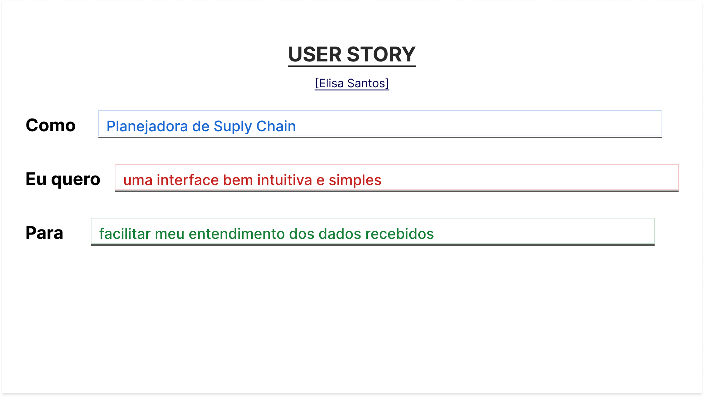

# Entendimento da experiência do usuário

&emsp;A fim de se construir uma solução tecnológica de fato eficaz para um problema, é crucial considerar a experiência do usuário como parte central do desenvolvimento, pois o produto final deve atender às necessidades e sanar as dores daquele que o utiliza, contribuindo para a realização mais eficiente de seus objetivos. Para isso, são aplicadas técnicas e ferramentas que facilitam a visualização e o entendimento da relação entre o usuário e a solução desenvolvida, como as personas e as *user stories* (histórias de usuário).

&emsp;Dessa forma, com o objetivo de arquitetar uma solução adequada à problemática apresentada pela empresa parceira Vale e que maximize a qualidade da experiência do usuário final, mapeou-se o público-alvo de forma generalista para a concepção de uma persona do projeto e a ela foram atreladas *user stories* (histórias de usuário) que definem de forma específica seus objetivos e necessidades. Ambas as ferramentas e a maneira com que foram empregadas são definidas nas seções seguintes deste documento.

## Persona

&emsp;As personas [[01]](#ref1) são representações fictícias de clientes ideais, criadas com base em dados reais e características demográficas, comportamentais e psicográficas. Elas auxiliam na compreensão profunda das necessidades, preocupações e objetivos dos diferentes perfis que interagem com um produto ou serviço.

&emsp;Tendo em vista o escopo do projeto desenvolvido, o público-alvo definido consiste nos planejadores da *supply chain* (cadeia de abastecimento) da Vale, que são os usuários do produto final. Dessarte, propôs-se a persona descrita a seguir (figura 01).

Figura 01 - Persona do projeto

Fonte: Material produzido pelos autores (2023)

&emsp;Para fins de detalhamento, são explicados os tópicos presentes na imagem acima nas seguintes subseções.

### Descritivo da Persona

&emsp;Elisa Santos é uma mulher de trinta anos do Rio de Janeiro e que trabalha na sede da Vale na mesma cidade. Ela atualmente desempenha a função de planejadora de *supply chain* na empresa, ganha sete mil e quinhentos reais de salário mensal, possui uma graduação em engenharia de produção e cinco anos de experiência no mercado profissional. Além disso, Elisa    Por fim, Elisa valoriza a eficiência, a organização, o planejamento e o pensamento crítico, principalmente no ambiente de trabalho.

### Função

&emsp;Em sua rotina de trabalho cotidiana, Elisa possui duas resposabilidades principais: planejar os fluxos de transporte de minérios pela malha logística da Vale de forma otimizada para o atendimento pleno às demandas dos clientes e gerar relatórios que sumarizem esses fluxos para tanto permitir quanto favorecer a tomada de decisão de outros setores da empresa que dependem dessas informações, como o comercial e o de produção.

### Desafios atuais

&emsp;O principal desafio enfrentado atualmente por Elisa é a crítica falta de eficiência nas análises de fluxo de transporte de minérios pela extensa malha logística da Vale. Segundo Alexandre Pigatti, Líder de Inteligência Artificial e Democratização de Dados na empresa, uma análise completa hoje leva uma hora e meia em tempo de execução de *software* e comumente é executada múltiplas vezes, tanto para geração de diferentes resultados de acordo com os dados de entrada quanto para realização de correções, originando um custo temporal significativo operacionalmente.

&emsp;Dessa forma, a construção com antecedência de um planejamento mensal desses fluxos de transporte que atenda às demandas dos clientes de forma otimizada é consideravelmente dificultada, prejudicando o desempenho da Elisa em seu trabalho e da própria empresa como um todo.

### Motivações

&emsp;A motivação de Elisa mais diretamente conectada ao desenvolvimento deste projeto diz respeito ao aumento da eficiência dos processos envolvidos em sua rotina de trabalho cotidiana, pois busca-se desenvolver uma solução que proporcione a diminuição do custo temporal das ferramentas atuais utilizdas pela planejadora de *supply chain*, o que colaboraria para a realização de seus objetivos.

&emsp;Ademais, visando um maior alinhamento individual e da empresa em relação a metas de sustentabilidade ambiental, a persona construída também tem como motivação a diminuição da emissão de poluentes nas atividades da Vale, o que pode ser uma consequência da maior eficiência no transporte da produção e do planejamento preciso e antecipado dos fluxos de atendimento às demandas dos clientes da empresa.

### Relação com tecnologia

&emsp;Elisa possui um letramento digital avançado e utiliza diariamente tecnologias que auxiliam no desempenho de suas funções como planejadora de *supply chain* da Vale. Normalmente, ela trabalha por um computador, usando principalmente planilhas, aplicativos de comunicação e *softwares* internos da empresa.

### Necessidades

&emsp;Consoante às informações supracitadas referentes ao grave déficit de eficiência nas análises dos fluxos de transporte, a principal necessidade de Elisa Santos é a redução do tempo de execução do *software* que computa as análises e os fluxos ideais, possibilitando, assim, a realização de mais atividades que agregam valor significativo em sua rotina de trabalho e otimizando o custo temporal para a empresa.

&emsp;Além dessa, Elisa também se beneficiaria de uma interface de visualização clara, precisa e detalhada desses fluxos e do processo de decisão que levou o *software* a gerar os *outputs* observados, integrando design a uma funcionalidade essencial.

### Objetivos

&emsp;Primeiramente, como um objetivo individual, Elisa pretende alavancar sua carreira através de um aprimoramento de sua performance e da geração de valor significativo para a Vale, o que vai ao encontro dos possíveis benefícios resultantes da solução desenvolvida neste projeto, principalmente no que tange a almejada maximização da eficiência nos processos.

&emsp;Em segundo lugar, a persona em questão também deseja fornecer relatórios precisos e com antecedência para outros setores da empresa que consomem informações advindas do planejamento da cadeia de abastecimento, aprimorando, assim, a capacidade de tomada de decisão dessas outras áreas e favorecendo a Vale como um todo.

### Frases relevantes

&emsp;No contexto de desenvolvimento de uma persona para um projeto, as frases relevantes simulam possíveis falas reproduzidas pela pessoa fictícia criada que se conectam com o escopo do problema e da solução construída, geralmente exprimindo os sentimentos de frustração e de desejo dessa personagem que inspiram o desenvolvimento. Dessa forma, estipulou-se as seguintes frases:

- “Não aguento mais esperar tanto tempo para rodar uma única análise, isso dificulta muito o cumprimento dos meus prazos de entrega.”;

- “Uma maneira mais interativa e visual de observar os fluxos seria bastante positiva na verdade. Essa visão planilhar é pouco eficiente.”.

## *User Stories*

&emsp;As *user stories* descrevem funcionalidades que são valiosas tanto para usuários finais quanto para clientes de um sistema ou *software*. A estrutura de uma *user story* na metodologia INVEST (*Independent*, *Negotiable*, *Valuable*, *Estimable*, *Small and Testable*, ou independente, negociável, valiosa, estimável, pequena e testável), técnica para criação de histórias de usuário em metodologias ágeis de desenvolvimento [[3]](#ref3), é simples e visa promover a compreensão clara do que precisa ser desenvolvido, do ponto de vista do usuário. Além disso, elas oferecem uma abordagem flexível ao desenvolvimento, possibilitando ajustes rápidos às necessidades dos usuários conforme o projeto avança. Ela tipicamente segue um formato de "Como (usuário)", "Eu quero (desejo)" e "Para (benefício)" e enfatiza a importância de focar no usuário e nos benefícios proporcionados pelas funcionalidades desenvolvidas, garantindo que o produto final esteja alinhado com as expectativas e necessidades dos clientes. [2]

&emsp;Seguem algumas *User Stories* associadas a Persona do projeto:

Figura 02 - User Story 1

Fonte: Material produzido pelos autores (2024)

&emsp;Para a planejadora de *supply chain*, é importante que o algoritmo seja bem rápido, uma vez que ela é a responsável pela definição das rotas de escoamento da produção de minérios da empresa e pela criação de relatórios que detalham esses fluxo de transporte. Com essa rapidez do algoritmo, seu trabalho é facilitado e o tempo consumido é reduzido.

Figura 03 - User Story 2

Fonte: Material produzido pelos autores (2024)

&emsp;Com um algoritmo bem desenvolvido e modelado, é possível que a planejadora de *supply chain* consiga otimizar de maneira mais eficiente as rotas de escoamento de produção da Vale, consequentemente colaborando para o envio de maiores quantidades de minérios aos locais designados e para o atendimento mais satisfatório dos clientes da empresa.

Figura 04 - User Story 3

Fonte: Material produzido pelos autores (2024)

&emsp;O uso de uma interface intuitiva e simples auxilia na visualização e entendimento dos dados, uma vez que não há a necessidade de vasculhar em arquivos gerados (como XML's ou JSON's) que podem ter estruturas confusas, melhorando assim o entendimento dos mesmos.

Figura 05 - User Story 4

Fonte: Material produzido pelos autores (2024)

&emsp;Utilizando-se de uma interface em grafos, o entendimento do fluxo na rede de transportes da Vale se torna muito mais facilmente compreensível, visto que seu estilo de representação torna mais prática a visualização de conexões nas rotas e como determinado lote chegou a um cliente.

Figura 06 - User Story 5

Fonte: Material produzido pelos autores (2024)

&emsp;Desenvolveremos um software que organiza a logística de transporte de minério, respeitando limites de capacidade e prazos predefinidos, para planejamento mensal eficiente.

Figura 07 - User Story 6

Fonte: Material produzido pelos autores (2024)

&emsp;O sistema será validado com dados operacionais reais para assegurar que atenda às demandas dentro das restrições existentes, elevando a precisão do planejamento.

Figura 08 - User Story 7

Fonte: Material produzido pelos autores (2024)

&emsp;Implementaremos uma ferramenta de decisão para escolher rotas de distribuição de minério que otimizem a logística e cumpram com as demandas dentro dos tempos estipulados.

Figura 09 - User Story 8

Fonte: Material produzido pelos autores (2024)

&emsp;O software será adaptável para incluir futuras restrições operacionais, permitindo ajustes detalhados diários para responder com agilidade às mudanças e manter a precisão do planejamento.

&emsp;Com essas *User Stories*, se torna mais fácil entender as situações que o usuário passa, visualizando assim de forma mais efetiva e pautada em situações reais as necessidades que devem ser atendidas pelo produto. Com essa compreenção da experiencia do usuário da Vale, a criação de um produto que se molde as suas vontades e objetivos se torna mais palpável e facilita no direcionamento da equipe para o desenvolvimento de uma solução melhor.

# Referências Bibliográficas

[1] SIQUEIRA, A. **Persona: o que é e como criar uma para a sua empresa.** Resultados Digitais. 14 fev. 2022. Disponível em: https://resultadosdigitais.com.br/marketing/persona-o-que-e/. Acesso em: 06 fev. 2024.

[2] SCARIOT, Ana Paula. **User Stories: boas práticas, estruturação e dicas extras.** CWI. 03 ago. 2023. Disponível em: https://cwi.com.br/blog/user-stories-estruturacao-e-dicas-extras/. Acesso em: 09 fev. 2024

[3] REDAÇÃO XP EDUCAÇÃO. **Metodologia INVEST: aprenda a criar histórias de usuários.** XP. 12 nov. 2022. Disponível em: https://cwi.com.br/blog/user-stories-estruturacao-e-dicas-extras/. Acesso em: 09 fev. 2024