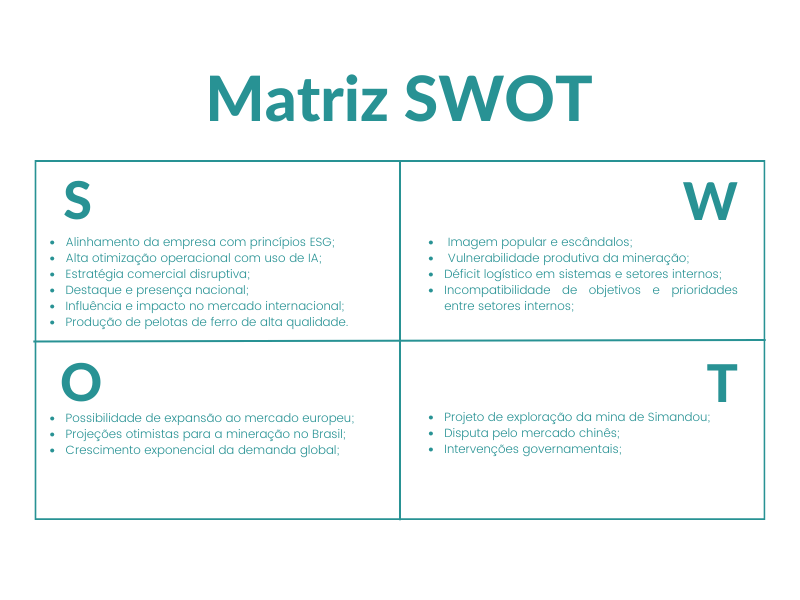
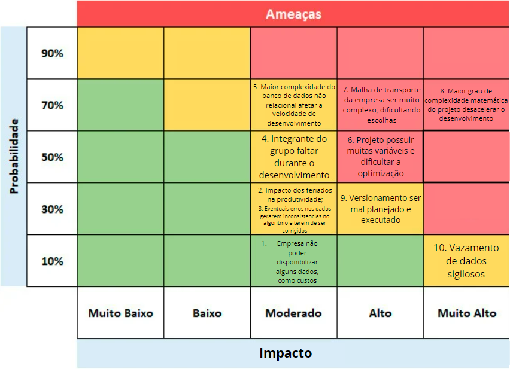
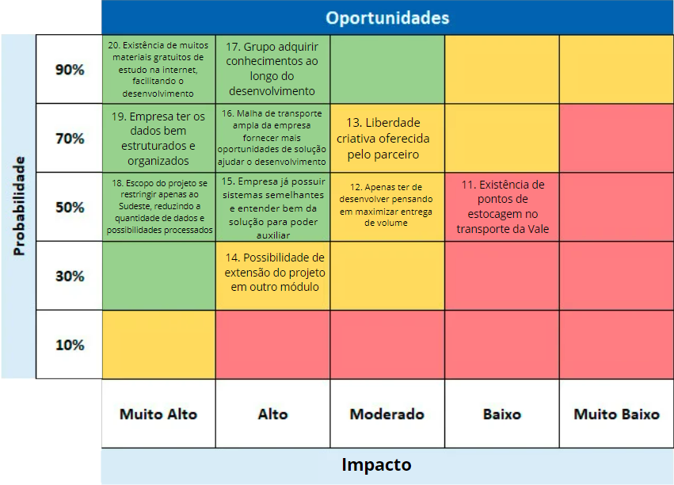

# Entendimento de negócios

&emsp;A fim de obter resultados satisfatórios no desenvolvimento deste projeto com a Vale, é imprescindível que o grupo tome conhecimento do contexto de negócios no qual a empresa está inserida, favorecendo, assim, a produção de uma solução tecnológica adequada e eficiente para o tratamento da problemática enfrentada. Isso inclui analisar o mercado como um todo e também de forma mais específica para o levantamento de dados acerca do setor em que a Vale atua, mapear o cenário atual e as projeções futuras para este campo da mineração exportadora e usufruir dessas informações para arquitetar um produto final da maneira mais apropriada possível.

&emsp;Dessa forma, documenta-se nas seguintes seções os métodos e ferramentas utilizados para a realização de análises mercadológicas acerca da Vale, como a Matriz SWOT (*Strengths*, *Weaknesses*, *Opportunities* e *Threats*) e as Cinco Forças de Porter, as conclusões geradas por esses processos, a visão de negócios referente ao problema apresentado pela empresa, com o uso de *frameworks* como a matriz de riscos e o *value proposition canvas* (canvas proposta de valor) e a respectiva solução desenvolvida pelo grupo JaVale.

## 1. Descrição da Solução a ser desenvolvida

&emsp;No tocante ao desenvolvimento deste projeto, foi proposta a criação de uma solução tecnológica digital que fizesse uso da teoria dos grafos, ramo da matemática que estuda a representação de objetos de um conjunto e suas relações [[13]](#ref13), para sanar o déficit de eficiência logística no planejamento de fluxos de transporte para escoamento da produção de minérios da Vale. Esse problema decorre atualmente de dois fatores principais: longo tempo de execução dos algoritmos implementados no *software* que realiza os cálculos das rotas e ausência de uma visualização objetiva e clara dos fluxos.

&emsp;Para fins descritivos de aprofundamento, nas seguintes subseções, são detalhados o problema apresentado pela empresa parceira deste projeto e a solução apresentada pelo grupo JaVale.

### 1.1. Qual é o problema a ser resolvido

&emsp;O desafio consiste em otimizar o atendimento às demandas de minério de ferro dos clientes da Vale, por meio da modelagem em grafos para o planejamento eficiente dos fluxos de transporte da produção mineral, observando as distintas capacidades e limitações operacionais da malha logística. Esta necessidade é fundamental para a agilidade e previsibilidade das operações da Vale, visto que melhorias e otimizações no planejamento dessas rotas resultam em maior precisão e antecedência nas operações comerciais da empresa.

&emsp;Contudo, é essencial mencionar que, para o desenvolvimento do MVP (Produto Viável Mínimo) proposto para este projeto, apenas o subset da região Sudeste do Brasil da malha logística da Vale está sendo considerado. Adicionalmente, o projeto não abordará as variações na qualidade dos minérios para cada demanda específica. Essas delimitações visam simplificar a solução nesta fase inicial, com o objetivo de entregar um produto final satisfatório ao término do prazo de dez semanas, que posteriormente poderá ser evoluído pela empresa.

### 1.2. Qual a solução proposta 

&emsp;A solução proposta envolve o desenvolvimento de um software que aplique a modelagem em grafos para aprimorar o planejamento dos fluxos de minério de ferro da Vale na região Sudeste. Esse software processará informações como capacidades de produção e armazenamento das minas e usinas, capacidades e lead times da malha logística, demandas dos clientes, especificações dos portos e usinas, bem como os modais de transporte disponíveis. A partir desses dados, o software projetará o planejamento dos fluxos de minério para satisfazer as demandas de cada cliente da maneira mais eficaz, considerando os modais de transporte e capacidades disponíveis.

&emsp;Ademais, para favorecer a compreensão e o trabalho dos colaboradores em cima dos resultados trazidos pelo *software*, principalmente dos planejadores de *supply chain* da Vale, propôs-se o desenvolvimento de uma nova interface para visualização dos fluxos, que visa repaginar e modernizar o sistema planilhar utilizado atualmente.

### 1.3. Como a solução proposta deverá ser utilizada

&emsp;A solução proposta deverá ser utilizada pelos planejadores de *supply chain* da Vale. Eles vão inserir os dados necessários no *software* e utilizarão as saídas geradas como base para planejar os fluxos de minério de ferro de forma mais eficiente, maximizando o atendimento das demandas dos clientes. Afinal, o *software* não visa substituir o profissional, mas sim auxiliá-lo como uma ferramenta de trabalho para otimizar processos manuais e trazer *insights* que agreguem valor através da análise matemática dos fluxos de transporte.

### 1.4. Quais os benefícios trazidos pela solução proposta

&emsp;Os principais benefícios gerados pela solução para o problema de fluxo da Vale incluem:

- Atendimento mais eficiente das demandas dos clientes;
- Maior precisão e previsibilidade nas atividades comerciais da empresa;
- Geração de novas perspectivas e oportunidades para os planejadores de supply chain, decorrentes da otimização do tempo operacional;
- Melhoria na visualização dos fluxos de transporte planejados;
- Otimização do uso dos recursos disponíveis na malha logística, contribuindo para a agilidade operacional;
- Potencial de expansão e adaptação da solução para enfrentar desafios mais complexos no futuro.

### 1.5. Qual será o critério de sucesso e qual medida será utilizada para o avaliar

&emsp;O critério de sucesso será a capacidade do software em gerar um planejamento dos fluxos de minério que atenda às demandas dos clientes de forma eficiente, respeitando as restrições operacionais de custo e capacidade, e utilizando os recursos disponíveis de maneira otimizada. Esse sucesso será avaliado por meio de métricas como a taxa de atendimento das demandas dos clientes, a redução nos custos operacionais, a capacidade de adaptação da solução para resolver problemas mais complexos e o tempo de execução do *software* construído.

## 2. Contexto da Indústria

&emsp;Tendo em perspectiva o contexto da indústria na qual se situa a Vale, torna-se necessário para o entendimento do problema e na busca pela melhor solução. Dessa forma, ao analisar-se profundamente concorrentes, posicionamento e tendências do mercado de minérios, possibilita-se uma maior compreensão acerca da Vale e de como a solução é fundamental para gerir os fluxos de minérios pela cadeia de produção até o cliente final.

&emsp;A Vale, fundada em 1942, é uma empresa com uma história rica e um impacto significativo no mercado global de mineração. Sua sede está localizada no Brasil e conta com operações em diversos países, como Canadá, Indonésia e Reino Unido. Tendo o capital aberto (Vale3), a companhia conseguiu aumentar seu valor, sendo considerada em 2021 como a empresa mais valiosa da América Latina, com um valor de mercado superior a cem bilhões de dólares. Esse crescimento foi impulsionado pelo aumento da produção de ferro, o que não apenas fortalece a posição da Vale no mercado global, mas também por consequência auxilia no desenvolvimento do país. [[01]](#ref1)

&emsp;O mercado de minério de ferro é altamente influenciado pela demanda global, com o Brasil posicionando-se como um exportador chave, especialmente para a China, o maior importador mundial desse recurso. A posição privilegiada do Brasil deve-se não somente à quantidade mas também à qualidade de seu minério, destacando a interconexão econômica global e a importância estratégica da Vale neste contexto.

&emsp;Sendo uma empresa privada que inicialmente lida com a extração e processamento do minério de ferro, pelotas e níquel, a Vale buscando transformar o futuro e sua presença no mercado, envolve-se nas etapas logísticas também, lidando desde a mineração até o transporte para seus clientes globais. Apesar de ser uma das líderes no tratamento do minério, a companhia tem se empenhado em expandir e diversificar suas atividades. Abrangendo a ESG (Ambiental, Social e Governança) em suas operações, diminuindo os riscos ambientais e o impacto das minas. Com o uso da inteligência artificial e automação para otimizar suas operações, bem como o desenvolvimento e a utilização da energia sustentável em seus processos produtivos. A Vale investe em iniciativas como o PowerShift, voltado para o uso de fontes de energia sustentáveis. O desenvolvimento de novos produtos, como a areia sustentável, e institutos de pesquisa, como o Instituto Tecnológico e o Snolab, focados em inovações e descobertas que impulsionam a eficiência e a sustentabilidade na indústria. Além disso, a empresa tem se dedicado a melhorias em barragens e no tratamento de rejeitos, visando mitigar os impactos ambientais de suas operações. Isso é fundamental não apenas para atender às expectativas dos seus parceiros, mas também para garantir a confiança no mercado. [[02]](#ref2)

&emsp;Frente aos desafios logísticos de alcançar mercados internacionais distantes, a Vale desenvolveu estratégias eficazes para assegurar sua presença competitiva. Em 2021, a Rússia era uma fonte principal para a União Europeia, fornecendo minério para países como Holanda, Itália e Alemanha. No entanto, as alterações geopolíticas que levaram ao término das importações de minério russo pela União Europeia abriram novas oportunidades para a Vale. Mais recentemente, o projeto de criação de *Mega Hubs* [[14]](#ref14), complexos industriais voltados à fabricação de produtos siderúrgicos de baixo carbono, visa suprir a demanda agora livre no mercado europeu, característico pela exigência de adequação da produção das empresas à políticas sustentáveis, e aproximar-se ainda mais do mercado chinês, reforçando a logística e a influência global da Vale [[03]](#ref3). No entanto, um desafio interno crucial que se apresenta para a Vale é a otimização dos fluxos de minério, uma vez que a eficiência da logística de transporte é essencial para alcançar o cliente final eficazmente. Este problema exige uma abordagem cuidadosa e inovadora para garantir a maximização do atendimento aos clientes, considerando as diversas capacidades ao longo da malha logística da empresa.

&emsp;No competitivo cenário global, a Vale enfrenta gigantes do setor como BHP Billiton e Rio Tinto, empresas australianas com uma forte presença na mineração. A competição entre essas corporações é intensa, com cada uma buscando ampliar suas quotas de mercado e inovar em suas ofertas e processos. A estratégia e adaptabilidade da Vale a destacam nesse contexto, evidenciando sua habilidade em responder a desafios e oportunidades com agilidade. Sobre uma das concorrentes, a BHP Billiton, fundada em 1885, assumiu o posto de maior mineradora do mundo, tornando-se referência na época [[04]](#ref4). Já a Rio Tinto, sendo a mais antiga entre as três, fundada em 1873, também é uma concorrente relevante [[05]](#ref5). Todas as três empresas estão constantemente em uma grande competição por espaço no mercado, buscando oportunidades de compra e venda de ações para fortalecerem suas posições. É interessante notar que em 2007, havia expectativas em relação a uma possível compra da Rio Tinto pela BHP, o que teria potencializado o mercado e intensificado ainda mais a competitividade entre as três grandes empresas, mas essa transação não se concretizou. [[06]](#ref6)

&emsp;Em conclusão, a Vale é reconhecida não apenas pela sua posição de liderança na mineração, mas também pelo seu firme compromisso com práticas sustentáveis e inovadoras, bem como pela eficiência operacional. Seu contínuo esforço para expandir o mercado global e aprimorar a cadeia logística em resposta às mudanças no fornecimento global demonstra sua habilidade de adaptação e visão de longo prazo, consolidando sua posição como referência no setor de mineração e no desenvolvimento sustentável socioeconômico.

## 3. Análise SWOT

&emsp;A análise SWOT avalia a empresa em relação ao mercado de maneira geral. Para isso, são analisados fatores referentes aos ambientes interno e externo do negócio, ou seja, o que está dentro da esfera de controle da empresa e o que não está. Portanto, são avaliadas no ambiente interno “Strengths” (“Forças”; características que trazem um diferencial em relação aos concorrentes e podem influenciar positivamente) e “Weaknesses” (“Fraquezas”; elementos que, por não serem pontos fortes da empresa, fornecem algum tipo de vantagem aos competidores e podem influenciar negativamente), enquanto no ambiente externo são analisadas “Opportunities” (“Oportunidades”; dizem respeito a possibilidades de obter melhores resultados, maior lucratividade ou crescer por causa de conjunturas externas favoráveis) e “Threats” (“Ameaças”; referem-se aos cenários externos desfavoráveis que colocam em risco o desenvolvimento ou a permanência da empresa no mercado).

&emsp;A seguir, na figura 01, demonstra-se a matriz SWOT construída pelo grupo JaVale em relação à Vale, empresa parceira deste projeto e alvo das análises de mercado desenvolvidas.

Figura 01: Matriz SWOT

Fonte: Material desenvolvido pelos autores (2024)

&emsp;Na sequência, são justificados e detalhados os pontos supracitados na imagem, a fim de explanar a análise feita pelo grupo acerca da Vale.

### Forças

&emsp;Alinhamento da empresa com princípios ESG (*Environmental*, *Social and Governance*): a Vale declara que seus processos produtivos e comerciais atualmente são administrados visando o menor impacto negativo possível ao meio ambiente e à sociedade, o que condiz justamente com os príncipios ESG e permite a perpetuação da empresa na conjuntura moderna e abre portas para mercados que valorizam essas práticas, como o europeu. Exemplos que constatam esse fato são o projeto de criação dos *Mega Hubs* no Oriente Médio, a aplicação do canhão de névoa no porto de Tubarão (Espírito Santo) para reduzir a emissão de particulado e os objetivos ESG estabelecidos pela empresa, que incluem a eliminação de barragens em condições críticas de segurança, políticas afirmativas internas, redução da emissão de gases de efeito estufa, entre outros [[15]](#ref15).

&emsp;Alta otimização operacional com o uso de IA (inteligência artificial): a inovação tecnológica é realidade para a Vale nos mais diversos setores da empresa. Segundo Alexandre Pigatti, líder deste projeto e *Head* de Inteligência Artificial e Democratização de Dados da Vale, a inteligência artificial é amplamente aplicada nas cadeias produtiva e corporativa para maximização da eficiência nos mais diversos processos, como ativação do canhão de névoa supramencionado e otimização de caminhos de transporte dos minérios para maximizar ganhos e auxiliar na tomada de decisão dos colaboradores.

&emsp;Estratégia comercial disruptiva: no mercado de mineração internacional, o padrão que a maioria dos produtores segue é a comercialização da produção em território nacional ou a exportação para países próximos, a exemplo das mineradoras dos Estados Unidos e da Rússia. Entretanto, a Vale se diferencia consideravelmente nesse quesito, pois faz negócios majoritariamente com economias asiáticas e distantes do território Brasileiro ou mesmo da América Latina, o que reflete tanto sua importância e magnitude no mercado quanto sua superioridade logística e a eficiência de seus modelos de precificação, que a tornam capaz de atender demandas como essas e se manter como uma das mais valorizadas empresas do mundo.

&emsp;Destaque e presença nacional: apesar de exportar a maior parte de sua produção, o mercado nacional é uma prioridade para a Vale e é atendido em primeiro lugar pela empresa. Afinal, ela é dominante do mercado de minérios nacional e representa cerca de 80% de toda a produção brasileira do setor [[16]](#ref16), o que a torna a principal figura para praticamente todas as compradoras de aço do Brasil e a coloca em uma posição de mercado muito superior no cenário nacional, pois muitas empresas brasileiras são atendidas exclusivamente pela Vale.

&emsp;Influência e impacto no mercado internacional: devido a sua magnitude e importância no mercado internacional, as atividades comerciais da Vale influenciam consideravelmente o próprio preço dos minérios e o mercado como um todo. Afinal, a empresa é uma das maiores exportadoras do mundo e possui diferentes compradores em diversos países; logo, o mercado se tornou dependente do seu volume produtivo para o atendimento das demandas globais. Isso também adiciona à reputação e à confiabilidade da empresa, favorecendo sua posição de mercado e sua imagem para os clientes.

&emsp;Produção de pelotas de ferro de alta qualidade: a Vale, uma das principais mineradoras globais e responsável por 80% da produção brasileira de pelotas de ferro, é reconhecida por sua produção de alta qualidade. Com tecnologia de ponta e um compromisso contínuo com a excelência, a Vale se destaca no mercado por seus avanços na blendagem e em seus processos industriais.

### Fraquezas

&emsp;Imagem popular e escândalos: principalmente no Brasil, a Vale ainda é conhecida e lembrada como uma empresa negligente e responsável por impactos desastrosos à sociedade e ao meio ambiente, como os danos causados à população do Espírito Santo com as atividades extrativistas no estado [[17]](#ref17) e o rompimento das barragens de Brumadinho e Mariana (Minas Gerais) [[18, 19]](#ref18). Esse reconhecimento prejudica a imagem nacional da empresa, o que pode prejudicar a possível busca por novos colaboradores ou acionistas.

&emsp;Vulnerabilidade produtiva da mineração: no ramo da mineração, as atividades produtivas devem ser iniciadas em um ponto de extração mediante a um acordo de exploração da área estabelecido entre a empresa mineradora e a figura ou órgão responsável por aquela reserva mineral. Uma vez iniciadas, essas atividades não podem ser interrompidas até o esgotamento ou alcance de objetivo de exploração definido daquele ponto, ainda que a demanda não corresponda à produção. Por isso, as mineradoras como a Vale estão de certa forma vulneráveis a uma diminuição da demanda global por aço que torne a produção menos ou não lucrativa.

&emsp;Déficit logístico em sistemas e setores internos: essa fraqueza da Vale diz respeito à falta de eficiência em alguns de seus processos internos, como no planejamento de fluxos de transporte para escoamento da produção pela malha logística da empresa e na geração de relatórios descritivos desses fluxos. Essa é a fraqueza ligada diretamente a este projeto em questão, que denuncia a existência desse problema na corporação.

&emsp;Incompatibilidade de objetivos e prioridades entre setores internos: como relatado pelo supracitado Alexandre Pigatti, a Vale sofre com algum nível de incoerência entre os objetivos e as prioridades entre setores internos da empresa. Por exemplo, enquanto o setor de produção quer maximizar o volume produtivo, o setor comercial quer maximizar a qualidade do minério extraído. Essas discordâncias podem escalar para problemas internos graves e gerar inconsistências entre a cadeia produtiva e as áreas de marketing e comercialização, impactando diretamente no atendimento às demandas dos clientes e, consequentemente, na saúde da empresa no mercado. 

### Oportunidades

&emsp;Possibilidade de expansão ao mercado europeu: caracterizado por ser exigente e demandar por empresas que estejam alinhadas com práticas de sustentabilidade e proteção ambiental, o mercado europeu se torna uma oportunidade de expansão para a Vale devido às ações da empresa voltadas a políticas ESG, principalmente com o projeto recente de criação de *Mega Hubs* no Oriente Médio [[14]](#ref14), que promete tanto o aumento produtivo que capacite a empresa para suprir esse novo mercado quanto a descarbonização de suas atividades extrativistas.

&emsp;Projeções otimistas para a mineração no Brasil: segundo o SGB (Serviço Geológico do Brasil) [[08]](#ref8), o Brasil está na vanguarda do alinhamento do extrativismo mineral com políticas de proteção ao meio ambiente e da exploração moderna e tecnológica para descoberta de novos pontos de mineração, com ampla perspectiva de abertura de novas minas por todo o território do país. Logo, a Vale, empresa dominante da mineração brasileira, pode se beneficiar significativamente desse cenário otimista acerca do potencial de crescimento da atividade mineradora em solo nacional.

&emsp;Crescimento exponencial da demanda global: para o ano de 2024 e também períodos futuros, os especialistas e pesquisadores projetam um crescimento exponencial da demanda global por aço [[08, 09]](#ref8), principalmente por conta do avanço tecnológico significativo do século atual, da consequente produção de diversos dispositivos e das atividades desenvolvidas por outros setores da economia, como a construção civil. Isso reflete em considerável valorização da Vale, uma das empresas mais relevantes do mundo na área da mineração.

### Ameaças

&emsp;Projeto de exploração da mina de Simandou: categorizado como "o maior projeto de mineração do mundo" [[07]](#ref7), a exploração da mina de Simandou por concorrentes da Vale reflete a crescente ameaça de perda de presença no mercado asiático que a empresa sofre devido à expansão de suas competidoras. Esse processo pode acarretar em severa desvalorização da companhia brasileira, o que a força a buscar alternativas, como está acontecendo com os *Mega Hubs* do Oriente Médio.

&emsp;Disputa pelo mercado chinês: sendo a China a maior importadora de minérios brasileiros [[3]](#ref3), com significativa superioridade de importações em relação aos outros consumidores, a elevada competição no mercado e a expansão de competidoras australianas e chinesas com projetos como a supracitada exploração da mina de Simandou representam ameaças latentes para a Vale, que perderia muito valor de mercado com a diminuição de sua presença nas exportações para o país asiático em questão. 

&emsp;Intervenções governamentais: recentemente, as ações do governo brasileiro sobre a Vale têm sido mal recebidas pelos acionistas da empresa, a exemplo da tentativa de nomeação de um novo CEO para a mineradora, que gerou insatisfação entre os investidores [[10]](#ref10). Com o recuo do governo nesse processo, as ações da Vale imediatamente subiram, refletindo a opinião negativa dos acionistas acerca das atitudes governamentais e demonstrando como elas podem gerar um impacto negativo [[11]](#ref11). Como um último exemplo, é possível citar a exorbitante cobrança de mais de vinte e cinco bilhões de reais por renovações de concessões do governo para a Vale [[12]](#ref12), que representa um impacto direto de intervenções governamentais nos negócios da corporação.

## 4. Análise das Cinco Forças de Porter

&emsp;A análise das 5 Forças de Porter é uma ferramenta essencial para compreender a dinâmica competitiva e o ambiente estratégico no qual a Vale se insere, especialmente em relação ao grupo JaVale. Esta ferramenta analítica permite avaliar a intensidade da competição, o poder de negociação com fornecedores e compradores, a ameaça de novos entrantes e de produtos substitutos, oferecendo uma visão abrangente dos desafios e oportunidades enfrentados pela empresa. Ao aplicar as 5 Forças de Porter à Vale, buscamos não apenas entender a posição atual da empresa no mercado global de mineração, mas também antecipar movimentos estratégicos que possam fortalecer sua competitividade frente às inovações e mudanças no setor. Este enfoque estratégico é vital para o planejamento a longo prazo e para a sustentação da liderança da Vale no cenário global, considerando as dinâmicas complexas e os constantes avanços tecnológicos que caracterizam a indústria de mineração.

### Concorrentes
&emsp;A concorrência na indústria de mineração é definida por uma luta constante por eficiência operacional, inovação tecnológica e sustentabilidade. Atualmente existem três grandes mineradoras que dominam o mercado, a Vale e as suas demais concorrentes BHP Billiton e Rio Tinto. 

BHP Billiton:

&emsp;Estabelecida em 1885, a BHP Billiton destaca-se no setor de mineração pela sua tradição e diversificação de portfólio, operando em vários continentes com uma vasta gama de commodities, incluindo petróleo, potássio, carvão e minério de ferro. Em 2020, a empresa reportou uma produção de 248 milhões de toneladas de minério de ferro, evidenciando sua liderança global. Recentemente, a BHP demonstrou um sólido desempenho operacional, com destaque para a produção de minério de ferro e cobre, refletindo um aumento significativo na produção na Western Australia Iron Ore (WAIO) e um recorde na mina de Spence. Os investimentos contínuos em tecnologia, automação e práticas sustentáveis sublinham seu compromisso com a eficiência operacional e a responsabilidade ambiental. [[22]](#ref22)

Rio Tinto:

&emsp;Desde sua fundação em 1873, a Rio Tinto tem mantido uma presença global significativa, com diversificação em alumínio, cobre, diamantes e minério de ferro. A produção de minério de ferro alcançou 286 milhões de toneladas em 2020, ressaltando sua posição competitiva. Mantendo um foco estratégico em materiais essenciais para a economia de baixo carbono, a Rio Tinto investe em segurança, sustentabilidade ambiental e engajamento comunitário. A empresa enfatiza resiliência e crescimento, com investimentos em tecnologia e sustentabilidade que refletem uma abordagem voltada para o futuro, alinhada às tendências de desenvolvimento de recursos mais verdes e éticos. [[20]](#ref20)

&emsp;Abaixo, é possível visualizar as respectivas parcelas de mercado em porcentagem das empresas supramencionadas (tabela 01) [[3]](#ref3).

Tabela 01: Market Share da Vale, BHP Billiton e Rio Tinto

| Ano | Vale | BHP Billiton | Rio Tinto |
|---|---|---|---|
| 2020 | 20% | 18% | 17% |
| 2021 | 21% | 19% | 18% |
| 2022 | 22% | 18% | 17% |
| 2023 | 23% | 19% | 16% |
| 2024 (estimativa) | 24% | 18% | 16% |

Fonte: OEC (2023)

&emsp;A partir dessa visualização acima, constata-se o constante crescimento da Vale nos últimos anos e observa-se a estabilidade de suas concorrentes no mercado.

### Fornecedores:

&emsp;A gestão da cadeia de fornecedores da Vale é um elemento crítico que sustenta suas operações globais de mineração, abrangendo uma ampla gama de produtos e serviços, desde equipamentos de mineração de alta tecnologia até soluções avançadas de software. Esta diversidade de fornecimento não só ajuda a Vale a mitigar riscos associados à dependência de fornecedores únicos, mas também permite que a empresa se beneficie de inovações contínuas que podem melhorar a eficiência operacional e promover práticas mais sustentáveis. A empresa valoriza fortemente a inovação e a tecnologia em sua cadeia de fornecimento, buscando parceiros que ofereçam soluções de ponta em automação, inteligência artificial e energia renovável. Tais parcerias são vitais para os objetivos da Vale de aumentar a segurança no trabalho, otimizar a produção e minimizar o impacto ambiental de suas operações.

&emsp;Além disso, a sustentabilidade e a responsabilidade social desempenham um papel central nas relações da Vale com seus fornecedores. A empresa estabeleceu padrões rigorosos baseados em critérios ambientais, sociais e de governança (ESG), que seus fornecedores devem atender ou exceder. Isso inclui desde a garantia de práticas de trabalho seguras e justas até o comprometimento com a redução das emissões de carbono e a conservação dos recursos naturais. A Vale promove esses valores por meio de iniciativas como o programa "Vale Suppliers", incentivando seus fornecedores a adotarem práticas sustentáveis, o que contribui para uma cadeia de valor mais responsável e sustentável em toda a indústria.

&emsp;Contudo, gerenciar uma cadeia de suprimentos tão extensa e diversificada traz seus próprios desafios, desde a logística complexa de garantir entregas pontuais de equipamentos críticos em locais remotos até manter a conformidade com os padrões ESG em diferentes regiões. Apesar desses desafios, a abordagem estratégica da Vale em relação aos seus fornecedores oferece oportunidades únicas para a empresa liderar pelo exemplo, estabelecendo novos padrões de eficiência e sustentabilidade na mineração global. A colaboração estreita com seus fornecedores, impulsionando inovações que beneficiam tanto a Vale quanto o setor mais amplo, permanece como uma chave fundamental para sua estratégia de manter a competitividade e a liderança de mercado. [[21]](#ref21)

### Compradores:

&emsp;A relação da Vale com seus compradores é um aspecto fundamental da sua estratégia de negócios, refletindo a importância de entender e atender às necessidades de uma base de clientes global e diversificada. Esses compradores variam amplamente em setores e regiões, incluindo desde gigantes da indústria siderúrgica até fabricantes de baterias para veículos elétricos, bem como empresas de construção civil em todo o mundo. Esta diversidade de mercado não só amplia o alcance da Vale, mas também expõe a empresa a uma ampla gama de demandas e expectativas.

&emsp;A China, como o maior mercado consumidor de minério de ferro, destaca-se como um pilar significativo para a Vale. A demanda chinesa por minério de ferro, crucial para a produção de aço, é um dos principais motores de receita para a empresa. Reconhecendo a importância desse mercado, a Vale tem implementado estratégias focadas em otimizar a cadeia de suprimentos e fortalecer as relações comerciais. Isso inclui o desenvolvimento de hubs logísticos, como o centro de distribuição na Malásia, que não só melhora a eficiência logística, mas também assegura uma entrega mais rápida e confiável de produtos aos clientes asiáticos. [[3]](#ref3)

&emsp;Além da siderurgia, a Vale também se posiciona estrategicamente para atender ao crescente mercado de tecnologias limpas e renováveis. A demanda por níquel, essencial para a fabricação de baterias de lítio em veículos elétricos, é um exemplo de como a empresa está se adaptando às mudanças nas necessidades dos consumidores, visando mercados emergentes com alto potencial de crescimento. Essa adaptabilidade não apenas abre novos canais de receita, mas também alinha a Vale com tendências globais de sustentabilidade e inovação tecnológica.

&emsp;Neste contexto, a dinâmica com os compradores reflete um equilíbrio entre atender às necessidades imediatas de mercado e antecipar as tendências futuras, garantindo que a Vale não apenas atenda à demanda atual, mas também esteja bem posicionada para aproveitar as oportunidades emergentes. Ao fazer isso, a Vale não só reforça sua posição como líder no mercado global de mineração, mas também demonstra seu compromisso com a inovação, a sustentabilidade e a excelência operacional.[[21]](#ref21)

### Novos Entrantes

&emsp;A indústria de mineração, na qual a Vale opera, é caracterizada por altas barreiras de entrada, incluindo, mas não se limitando à, capital intensivo necessário para exploração e desenvolvimento, regulamentações ambientais e sociais rigorosas, além da expertise técnica requerida para operações eficientes. No entanto, apesar dessas barreiras, o setor enfrenta uma ameaça constante de novos entrantes, especialmente em regiões com ricos depósitos minerais ainda não explorados ou subexplorados.

&emsp;Recentemente, a exploração de minas na África por empresas australianas exemplifica como novos competidores podem emergir e desafiar as posições estabelecidas por gigantes da mineração como a Vale. Estas empresas, muitas vezes apoiadas por significativos investimentos financeiros e tecnologias avançadas, buscam capitalizar sobre os vastos recursos minerais do continente africano. Sua entrada no mercado global de minério de ferro, por exemplo, representa um novo vetor de competição, oferecendo alternativas de fornecimento para mercados tradicionalmente dominados pela Vale e seus pares. [[24]](#ref24)

&emsp;Além dos recursos financeiros e da tecnologia, uma abordagem focada em sustentabilidade e responsabilidade social pode também ser um diferencial para esses novos entrantes, atraindo a atenção de clientes globalmente conscientes. Isso se alinha com a crescente demanda por práticas de mineração que minimizem o impacto ambiental e promovam o desenvolvimento social das comunidades locais.

&emsp;No entanto, a ameaça de novos entrantes permanece uma consideração crucial para a Vale, exigindo vigilância contínua e adaptação estratégica. A empresa deve equilibrar entre maximizar a eficiência operacional e investir em inovações tecnológicas e sustentáveis, garantindo sua posição de liderança num mercado global cada vez mais competitivo e dinâmico. A capacidade de antecipar e responder a essas ameaças não apenas determinará o sucesso contínuo da Vale, mas também moldará o futuro da indústria de mineração global.

### Produtos Substitutos

&emsp;Os substitutos dos produtos da Vale variam conforme o segmento de atuação. Para o minério de ferro, o aço reciclado pode ser uma alternativa em determinadas aplicações, embora a demanda por minério de alta qualidade permaneça forte para a produção de aço de alto desempenho. A Vale antecipa essas ameaças diversificando sua oferta de produtos, investindo em metais requisitados por tecnologias verdes, como o níquel para baterias de veículos elétricos, e desenvolvendo soluções inovadoras, como a produção de areia sustentável a partir de rejeitos de mineração.

## 5. *Value Proposition Canvas*

&emsp;O *Value Proposition Canvas* (Canvas de Proposta de Valor) é um *framework* de negócios utilizado para que os *stakeholders* tenham uma visão clara sobre qual o valor que o produto é capaz de oferecer. Assim, por meio da sua análise, é possível que a equipe envolvida seja capaz de perceber qual será a melhor abordagem possível para o seu desenvolvimento. 

&emsp;Para tal, o modelo é separado em duas seções, que se complementam. A primeira, chamada de *Customer Profile* (Perfil do cliente), analisa os principais problemas do cliente, por meio do detalhamento das suas dores, os serviços que precisam realizar, e os ganhos que eles poderiam adquirir com a melhora dessa serviço. A segunda, conhecida como *Value Map* (Mapa de valor), apresenta por sua vez o que a empresa criará de valor para o usuário, com base nos pontos apresentados no *Customer Profile*. Isso é feito por meio da descrição das ferramentas e produtos oferecidos, e como eles são capazes de sanar as dores do cliente e de gerar ganhos para ele. 

&emsp;Esse documento foi produzido levando em conta o *software* atual utilizado pelo parceiro, apresentado ao grupo durante o *onboarding*. De acordo com o que foi explicado, esse programa é capaz de realizar a logística de transporte dos minérios, mas é feito por meio de um processo lento. Por consequência, desperdiça muito tempo, dificultando e atrasando as tomadas de decisão. Assim, as dores foram descritas considerando principalmente esse aspecto.

&emsp;Segue abaixo a imagem do *Value Proposition Canvas* desenvolvido pelo grupo JaVale (figura 02), analisando a ideia de entrega para a Vale: 

Figura 02: *Value Proposition Canvas*

Fonte: Material desenvolvido pelos autores (2024)

  
&emsp;Na visualização acima, é possível visualizar as duas seções do *framework*, a *Customer Profile* e a *Value Map*, as quais serão abordadas em maior profundidade nas seguintes subseções.

### 5.1. *Customer Profile* 

#### *Customer Jobs* (Trabalhos do cliente)
 
&emsp;Considerando o contexto do desafio que nos foi proposto, o principal serviço da Vale é gerenciar a logística de transporte dos minérios na posse da mineradora. Essa malha é feita desde os fornecedores de minério da empresa, até os clientes nacionais e/ou internacionais do parceiro.

&emsp;Tal tarefa é feita, atualmente, por meio de um *software* que, atualmente, apresenta um desempenho lento. Por conta disso, muitas vezes demanda uma grande quantidade de tempo para que seja executado, além de apresentar uma visualização não intuitiva. Assim, é necessário que esse processo seja agilizado para entregar os resultados mais rapidamente e com uma visualização clara.

#### *Pains* (Dores)

&emsp;Considerando o trabalho que o cliente precisa realizar, é evidente que o tempo é o principal problema que ele enfrenta para ter sua tarefa completa. Isso se dá pela demora de execução do *software*, que leva em média 90 minutos para que termine a sua execução, segundo dados do parceiro.

&emsp;Por causa disso, o gestor responsável pela logística acaba subutilizando o seu tempo, já que esse processo precisa ser feito várias vezes, até que seja alcançado um resultado satisfatório. Esse tempo ocioso poderia ser redirecionado para tarefas mais importantes, e que poderiam gerar mais valor para a Vale.

&emsp;Além da questão do tempo, é importante frisar o ponto dos dados recebidos. De acordo com as informações obtidas no *workshop* com o parceiro, os dados enviados para o *software* muitas vezes não são devidamente tratados, possuindo inconsistências, dados faltantes e um formato um tanto antiquado (XML). Isso pode prejudicar a sua execução e gerar resultados incertos e menos confiáveis. 

&emsp; Por fim, temos a visualização dos dados gerados pelo *software*, que é feita atravéz de um sistema de tabelas. Essa forma de visualização dificulta o entendimento e relacionamento dos dados, além de não disponibilizar uma visão da malha de forma intuitiva.

#### *Gains* (Ganhos)

&emsp;Por meio do desenvolvimento de um programa mais eficaz, os clientes poderiam desfrutar de uma série de benefícios. Em destaque, seria possível alcançar uma gestão de tempo mais eficiente, por meio do aumento da velocidade de execução do *software*. Assim, o gestor responsável por esse processo poderia ser mais produtivo, assim como poderia tomar decisões de forma mais rápida e eficaz. 

&emsp;Além disso, poderia haver um ganho grande por meio do recebimento de dados com uma melhor qualidade. Informações devidamente tratadas sem inconsistências garantirão uma maior confiabilidade dos resultados do programa. 

### 5.2. *Value Map*

#### *Products & Services* (Produtos e Serviços)

&emsp;Analisando detalhadamente as dores do cliente, avaliamos o produto que seria capaz de saná-las e ao mesmo tempo gerar valor para ele. Assim, o mais eficiente será a criação de um *software* de gerenciamento de logística, com base no modelo de grafos, que apresente uma eficiência maior que o programa atual da Vale, e seja capaz de processar os dados mais rapidamente. 

&emsp;Além disso, levando em conta o problema dos dados, será necessário a criação de um algoritmo de tratamento de dados. Esse algoritmo será capaz de lidar com dados ausentes, assegurar que os fluxos nas rotas estão corretos e que as demandas de cada cliente estão corretas e sendo processadas. Assim, o grupo será capaz de garantir que as informações utilizadas no o modelo sejam de alta qualidade, garantindo a sua eficiência e confiabilidade. 

&emsp; Também será desenvolvida uma aplicação *web* para visualizar os dados e a malha de transportes da empresa. Assim, será garantido que a análise dos resultados gerados seja facilitada e mais compreensível. 

#### *Pain Relievers* (Aliviadores de Dores)

&emsp;Levando em conta as dores descritas na seção de *Customer Profile*, podemos avaliar quais seriam os principais mecanismos para atacar esses problemas. Logo, é necessário que o produto oferecido apresente suas principais características de acordo com isso. 

&emsp;Dessa forma, é necessário que o *software* apresente uma execução rápida, por meio da simplificação do processo de gerenciamento. Além disso, é necessário um tratamento prévio dos dados, para assegurar a sua qualidade e uma plataforma *web* fácil de navegar e reconhecer os *outputs* gerados pelo programa.

#### *Gain Creators* (Criadores de Ganho)

&emsp;Os criadores de ganho são baseados nos meios para alcançar os ganhos descritos na seção *Customer Profile*. Para tal, é necessário descrever qual abordagem será adotada para alcançar o que foi descrito. 

&emsp;Em relação à qualidade dos dados, é necessário que haja um tratamento prévio dos dados. Como supracitado, é preciso um algoritmo para realizar esse tratamento, e assegurar a qualidade técnica dos dados.

&emsp;Já sobre o tempo, é preciso abordar um processo simplificado, que seja capaz de reduzir o tempo de execução do programa. Assim, o gestor não precisará esperar 90 minutos para cada rodagem do *software*. 

&emsp; Por fim, também é importante o desenvolvimento de uma plataforma *web* que se adapte bem à natureza dos dados da empresa e que consiga mostrá-los da melhor forma possível. Assim, será possível facilitar o trabalho de análise dos dados e a geração de relatórios, que anteriormente era relativamente lento.

&emsp;Ao alcançar esses fatores, o produto oferecido será capaz de analisar a melhor gestão do fluxo de minérios da Vale, de forma precisa e ágil. Dessa maneira, será capaz de alcançar uma tomada de decisão mais veloz, e poupar recursos preciosos da empresa.

## 6. Matriz de Riscos

&emsp;A matriz de riscos e oportunidades é uma ferramenta utilizada na gestão de projetos, negócios e processos para identificar, avaliar e priorizar riscos e oportunidades. Esse tipo de matriz ajuda as organizações a compreender melhor os potenciais impactos positivos e negativos em seus objetivos, permitindo com que planejem estratégias mais eficazes para mitigar riscos e aproveitar oportunidades. Ela é dividida entre os setores de riscos e oportunidades, também subdividida em porcentagens de probabilidade da ocorrência de algo e de “Muito Baixo” até “Muito Alto” para o impacto dessa ocorrência. [[25]](#ref25)

&emsp;Segue a matriz de riscos e oportunidades desenvolvida para o projeto:

Figura 03 - Matriz de Riscos

Fonte: Material produzido pelos autores (2024)

&emsp;Abaixo, são detalhados e justificados os riscos definidos na matriz acima (figura 03).

&emsp;1. Empresa não poder disponibilizar alguns dados, como custos: Devido a confidencialidade dos dados, alguns que talvez fossem importantes para o algoritmo podem não estar disponíveis, podendo resultar em mais trabalho no desenvolvimento do algoritmo para alcançar melhores resultados;

&emsp;2. Impacto dos Feriados na Produtividade: Devido a feriados longos, por exemplo o Carnaval, o time acaba ficando longos períodos de tempos desunido, podendo resultar em &emsp;desalinhamentos em relação ao projeto atrasando seu desenvolvimento e as entregas;

&emsp;3. Erros nos dados gerarem inconsistências no algoritmo e terem de ser corrigidos: Eventuais erros na base de dados na empresa podem gerar atrasos no desenvolvimento do projeto, uma vez que podem ser numerosos e custosos de serem arrumados, levando a um trabalho extra por parte dos integrantes;

&emsp;4. Integrante do grupo faltar durante o desenvolvimento: Faltas de um ou mais indivíduos do grupo durante o desenvolvimento podem afetar a comunicação e o andamento das tarefas do projeto, resultando em possíveis erros ou complicações no cumprimento de prazos;

&emsp;5. Maior complexidade do banco de dados não relacional afetar a velocidade de desenvolvimento: Com um sistema novo de banco de dados, sua lógica pode se tornar um empecilho para o desenvolvimento geral do projeto, uma vez o time não possui conhecimentos sobre seu uso e como adapta-lo a situação do projeto;

&emsp;6. Projeto possuir muitas variáveis e dificultar a optimização: A existência de diversas variáveis e possibilidades dentro dos dados pode gerar uma situação onde um processamento massivo é necessário e, como o cliente necessita de uma solução de rápido funcionamento, optimizações podem ser necessárias, o que tomaria tempo e esforços da equipe;

&emsp;7. Malha de transporte da empresa ser muito complexa, dificultando escolhas: A Vale é uma empresa que possui uma malha de transporte muito distinta, com diversas modalidades diferentes de transporte. Assim, todas as possibilidades devem ser cogitadas no algoritmo, aumentando sua complexidade e necessidade de otimização, o que pode consumir muito tempo e esforços da equipe ou deixar o algoritmo muito pesado;

&emsp;8. Maior grau de complexidade matemática do projeto desacelerar o desenvolvimento: Com um grau maior de complexidade matemática do problema, a modelagem da solução pode acabar sendo desacelerada devido ao grau de entendimento dos integrantes não ser tão grande para o assunto, exigindo mais esforços e tempo para correta análise;

&emsp;9. Cliente não aprovar o que foi desenvolvido: Existe a possibilidade do cliente não acreditar que a solução gerada pela equipe foi satisfatória, assim fazendo com que o projeto tenha que ser reformulado, gerando mais retrabalhos e consumindo o tempo da equipe;

&emsp;10. Vazamento de dados sigilosos: Devido a natureza dos dados fornecidos pelo cliente, como rotas de entrega de material, quantidades, entre outros, eles são sigilosos e devem ser mantidos em segurança. Com um possível vazamento, medidas deverão ser tomadas para evitar com que esses dados se espalhem e o projeto teria de ser paralisado, assim encerrando momentaneamente ou permanentemente seu desenvolvimento.

Figura 04 - Matriz de Oportunidades

Fonte: Material produzido pelos autores (2024)

&emsp;Na sequência, são explicadas as oportunidades estabelecidas na matriz acima (figura 04).

&emsp;11. Existência de pontos de estocagem no transporte da Vale: Devido a presença de pontos de estocagem de minérios ao longo da malha de transportes da Vale, é mais fácil tratar o envio de minérios que está acima da demanda, possibilitando que ele seja realocado sem precisar de ser enviado a outro destinatário necessariamente, abrindo para mais oportunidades no algoritmo e como a equipe desenvolve as rotas de entrega;

&emsp;12. Apenas ter de desenvolver pensando em maximizar entrega de volume: A empresa já    expressou que deseja apenas a maximização de volume, assim facilitando o processo de desenvolvimento, uma vez que não deveremos considerar a maximização de lucro ou minimização de custos, por exemplo;

&emsp;13. Liberdade criativa fornecida pelo parceiro: Apesar de já possuir uma solução com modelagens matemáticas semelhantes ao projeto desenvolvido pela equipe, o parceiro permitiu que inovações fossem feitas e até mesmo abordagens completamente diferentes do já existente, abrindo assim para mais oportunidades de desenvolvimento para a equipe e possivelmente podendo melhorar o desempenho e resultados da mesma;

&emsp;14. Possibilidade de extensão do projeto em outro módulo: Devido a complexidade do problema apresentado, nem tudo que foi requisitado pela empresa poderá ser realizado no período de um módulo. Apesar disso, foi cogitada a possibilidade da continuidade do projeto em um módulo posterior, possibilitando um desenvolvimento ainda mais avançado do produto e atendendo a todos os requisitos solicitados pela Vale;

&emsp;15. Empresa já possuir sistemas semelhantes e entender bem da solução para poder auxiliar: Como a empresa já possui um sistema semelhante ao que está sendo desenvolvido, ela consegue com mais facilidade exprimir suas necessidades com o projeto e auxiliar no seu entendimento geral, também trazendo ideias e sugestões para a solução;

&emsp;16. Malha de transporte ampla da empresa fornecer mais oportunidades de solução ajudar o desenvolvimento: Com uma malha de transportes muito dinâmica e com diversas opções, muitas possibilidades de distribuição de recursos e alternativas de rotas são possíveis, favorecendo na garantia de um algoritmo que consegue melhor maximizar seus resultados;

&emsp;17. Grupo adquirir conhecimentos ao longo do desenvolvimento: Com o alto grau de complexidade do projeto e tudo o que o grupo deve aprender em seu desenvolvimento, muitos conhecimentos podem ser adquiridos, podendo contribuir tanto para o conhecimento pessoal quanto para o desenvolvimento do projeto.

&emsp;18. Escopo do projeto se restringir apenas ao Sudeste, reduzindo a quantidade de dados e possibilidades processados: A Vale é uma empresa que atende diversas regiões tanto do Brasil quanto do mundo. Sem a preocupação de atender a todas essas localidades, a complexidade do projeto é reduzida e fica mais fácil de otimizar e encontrar as melhores alternativas no algoritmo e melhor atender a uma região;

&emsp;19. Empresa ter os dados bem estruturados e organizados: A Vale está no mercado há vários anos, com o uso de tecnologia de ponta. Para isso, eles possuem bases de dados bem estruturadas, facilitando o desenvolvimento do projeto, uma vez que não são necessárias grandes alterações e assim haverá uma economia de tempo e esforços;

&emsp;20. Existência de muitos materiais gratuitos de estudo na internet, facilitando o desenvolvimento: Com a linguagem de programação, tecnologias e recursos matemáticos que serão utilizadas são muito conhecidas e abrangentes, existem muitos materiais de estudo gratuitos na internet e outros meios, ajudando em caso de dúvidas ou desconhecimento sobre algo importante para o projeto.

&emsp;Utilizando-se da matriz de risco, é mais fácil que o grupo compreenda quais os principais possíveis empecilhos ao projeto e quais são os pontos a serem explorados para seu melhor desenvolvimento. Com isso, o planejamento também é alterado para se adaptar as possíveis situações que influenciem no desenvolvimento do projeto, de modo a coordenar esforços onde realmente são necessários.

# Referências Bibliográficas

[1]: VALE (Brasil). Sobre a vale. In: VALE. Quem são . [S. l.], 2020. Disponível em: <a name="#ref1"> https://vale.com/pt/. </a> Acesso em: 6 fev. 2024.

[2]: FAYH, Marcelo. **O que faz Vale (VALE3) e os Diferenciais da Empresa.** The Capitol Advisor. 21 jan. 2021. Disponível em: <a name="#ref2">https://comoinvestir.thecap.com.br/o-que-faz-vale-vale3-e-os-diferenciais-da-empresa.</a> Acesso em: 07 fev. 2024.

[3]: OEC. Mineral Products. In: Mineral Products. [S. l.], 2021. Disponível em: <a name="#ref3"> https://oec.world/en/profile/hs/mineral-products?yearSelector1=2021.</a> Acesso em: 6 fev. 2024.

[4]: BHP BILLITON. Sobre BHP. In: Sobre BHP Billiton. [S. l.], 2023. Disponível em: <a name="ref4">https://www.bhp.com/about.</a> Acesso em: 7 fev. 2024.

[5]: SOBRE Rio Tinto. [S. l.], 2023. Disponível em: <a name="#ref5">https://www.riotinto.com/about.</a> Acesso em: 7 fev. 2024.

[6]: REDAÇÃO EXAME. União BHP e Rio eleva competição com Vale no longo prazo. Negócios, [S. l.], 19 maio 2011. Disponível em: <a name="#ref6">https://exame.com/negocios/uniao-bhp-rio-eleva-competicao-vale-longo-prazo-517732/.</a> Acesso em: 6 fev. 2024.

[07]: ARBEX, Pedro. **Rio Tinto dá a largada em Simandou, o maior projeto de mineração do mundo.** Brazil Journal. 07 jan. 2024. Disponível em: <a name="ref7">https://braziljournal.com/rio-tinto-da-a-largada-em-simandou-o-maior-projeto-de-mineracao-do-mundo/</a>. Acesso em: 08 fev. 2024.

[08]: SGB. **Mineração: Avanços e perspectivas para 2024.** Serviço Geológico do Brasil. 18 dez. 2023. Disponível em: <a name="ref8">https://www.sgb.gov.br/publique/Noticias/Mineracao%3A-Avancos-e-perspectivas-para-2024-8479.html</a>. Acesso em: 12 fev. 2024.

[09]: GeoInova. **Mineração e as tendências para o mercado em 2024: inovações e desafios.** GeoInova. 08 nov. 2023. Disponível em: <a name="ref9">https://geoinova.com.br/mineracao-e-as-tendencias-para-o-mercado-em-2024-inovacoes-e-desafios/</a>. Acesso em: 12 fev. 2024.

[10]: JR., Geraldo Campos. **Governo quer exercer autoridade sobre setor de mineração, diz Silveira.** Poder360. 31 jan. 2024. Disponível em: <a name="ref10">https://www.poder360.com.br/governo/governo-quer-exercer-autoridade-sobre-setor-de-mineracao-diz-silveira/</a>. Acesso em: 12 fev. 2024.

[11]: FERRARI, Hamilton. **Desistência de Mantega na Vale acelera alta das ações da empresa.** Poder360. 26 jan. 2024. Disponível em: <a name="ref11">https://www.poder360.com.br/economia/desistencia-de-mantega-na-vale-acelera-alta-das-acoes-da-empresa/</a>. Acesso em: 12 fev. 2024.

[12]: PODER360. **Governo Lula cobra R$ 25,7 bi da Vale por renovação de concessões.** Poder360. 27 jan. 2024. Disponível em: <a name="ref12">https://www.poder360.com.br/governo/governo-lula-cobra-r-257-bi-da-vale-por-renovacao-de-concessoes/</a>. Acesso em: 12 fev. 2024.

[13]: MELO, Gidson Soares de. **Introdução à Teoria dos Grafos.** Universidade Federal da Paraíba. Agosto de 2014. Disponível em: <a name="ref13">https://repositorio.ufpb.br/jspui/bitstream/tede/7549/5/arquivototal.pdf</a>. Acesso em:s 13 fev. 2024.

[14]: VALE (Brasil). **Vale avança no projeto dos Mega Hubs ao assinar acordo preliminar de fornecimento de aglomerados de minério de ferro com Essar Group.** Vale. 11 set. 2023. Disponível em: <a name="ref14">https://vale.com/pt/w/vale-avanca-no-projeto-dos-mega-hubs-ao-assinar-acordo-preliminar-de-fornecimento-de-aglomerados-de-minerio-de-ferro-com-essar-group</a>. Acesso em: 14 fev. 2024.

[15]: VALE (Brasil). Portal ESG. In: VALE. ESG. [S. l.], 2020. Disponível em: <a name="ref15">https://vale.com/pt/esg/home</a>. Acesso em: 14 fev. 2024.

[16]: GERBELLI, Luiz Guilherme. **Vale ganhou relevância na economia com aumento das exportações de minério.** G1. 29 jan 2019. Disponível em: <a name="ref16">https://g1.globo.com/economia/noticia/2019/01/29/vale-ganhou-relevancia-na-economia-com-aumento-das-exportacoes-de-minerio.ghtml</a>. Acesso em: 14 fev. 2024.

[17]: Mapa de Conflitos, Injustiça Ambiental e Saúde no Brasil. **ES – População da Grande Vitória sofre com poluição provocada por siderúrgicas e luta por indenizações.** Fiocruz. Setembro de 2018. Disponível em: <a name="ref17">https://mapadeconflitos.ensp.fiocruz.br/conflito/es-populacao-da-grande-vitoria-sofre-com-poluicao-provocada-por-siderurgicas-e-luta-por-indenizacoes/</a>. Acesso em: 14 fev. 2024.

[18]: Assembleia Legislativa de Minas Gerais. **
da barragem da Vale, em Brumadinho, completa quatro anos.** ALMG. 25 jan. 2023. Disponível em: <a name="ref18">https://www.almg.gov.br/comunicacao/noticias/arquivos/Rompimento-da-barragem-da-Vale-em-Brumadinho-completa-quatro-anos/</a>. Acesso em: 14 fev. 2024.

[19]: Ministério Público do Estado de Minas Gerais. **Rompimento da barragem de Fundão, em Mariana: resultados e desafios cinco anos após o desastre.** MPMG. 29 out. 2020. Disponível em: <a name="ref 19">https://www.mpmg.mp.br/portal/menu/comunicacao/noticias/rompimento-da-barragem-de-fundao-em-mariana-resultados-e-desafios-cinco-anos-apos-o-desastre.shtml</a>. Acesso em: 14 fev. 2024.

[20]: RIO TINTO. **Half Year 2023 Report.** Rio Tinto. 1 ago. 2023. Disponível em: <a name="ref20">https://www.riotinto.com/invest</a>. Acesso em: 15 fev. 2024.

[21]: VALE. **Produção e vendas da Vale no 4T23.** Vale. 31 dez. 2023. Disponível em: <a name="ref21">https://api.mziq.com/mzfilemanager/v2/d/53207d1c-63b4-48f1-96b7-19869fae19fe/9ba40f7b-dcab-3a22-f55d-91f8e5bf918a?origin=1</a>. Acesso em: 15 fev. 2024.

[22]: BHP BILLITON. **BHP Operational Review for the half year ended 31 December 2023.** BHP Billiton. 31 dez. 2023. Disponível em: <a name="ref22">https://www.bhp.com/news/media-centre/releases/2024/01/bhp-operational-review-for-the-half-year-ended-31-december-2023</a>. Acesso em: 15 fev. 2024.

[23]: INVEST TALK. **Petróleo e minério de ferro costumam mexer com o Ibovespa: entenda por quê.** Invest Talk. 9 out. 2023. Disponível em: <a name="ref23">https://investalk.bb.com.br/noticia/petroleo-e-minerio-de-ferro-costumam-mexer-com-o-ibovespa-entenda-por-que</a>. Acesso em: 15 fev. 2024.

[24]: REDAÇÃO. **Paralisação em mina na Guiné ameaça plano da China de aliviar dependência da Austrália.** A Referência. 21 mar. 2022. Disponível em: <a name="ref24">https://areferencia.com/destaque/paralisacao-em-mina-na-guine-ameaca-plano-da-china-de-aliviar-dependencia-da-australia/</a>. Acesso em: 15 fev. 2024.

[25]: Colleoni, João Paulo. **Matriz de riscos: entenda o que é e porque você deve começar a usar** 15 de fevereiro de 2024. SCOREPLAN. Disponível em: <a name="ref25"> https://scoreplan.com.br/blog/matriz-de-riscos/</a>. Acesso em: 10 fev. 2024.

