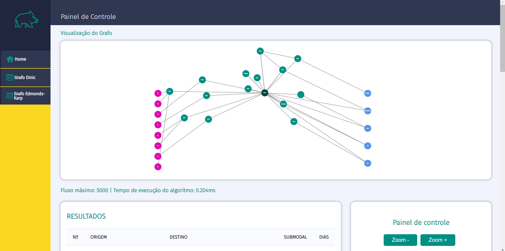
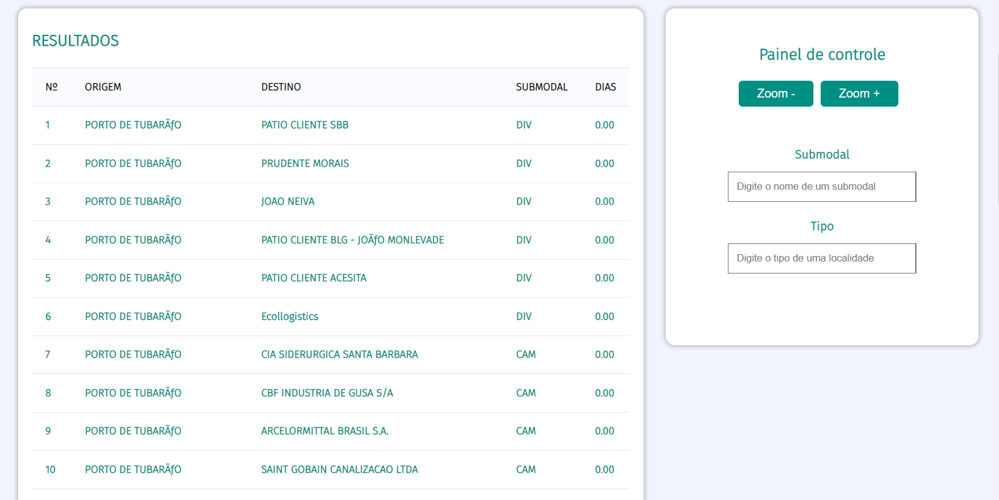
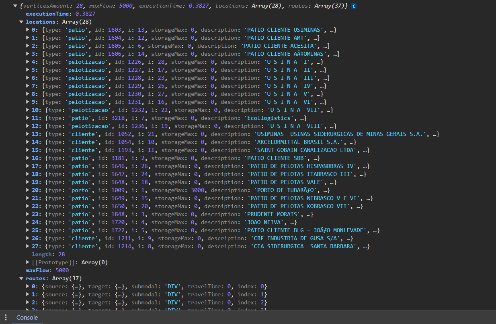

# Desenvolvimento de *Frontend* da aplicação

&emsp;Como requisitado pela Vale, empresa parceira do projeto, foi desenvolvido uma camada de *frontend* para a aplicação *web* do grupo JaVale, a fim de maximizar a experiênca do usuário utilizador da solução (o admnistrador de cadeia de produção) e facilitar a visualização dos resultados dos algoritmos aplicados. Dessa forma, buscou-se potencializar a maneira com que se analisa a malha logística e os fluxos através de uma visualização de um grafo real simulado visualmente, como demonstra a figura 01 abaixo.

Figura 01: Visualização da malha logística

Fonte: Material produzido pelos autores (2024)

&emsp;É possível perceber a partir da imagem acima (figura 01) que o desenvolvimento do *frontend* foi pensado realmente com o objetivo de oferecer uma nova opção de visualização para os colaboradores da Vale, que atualmente analisam esses dados de fluxo por tabelas CSV e uma aplicação própria que também permite uma visão apenas tabelar, mas de forma hierárquica. Por isso, também construiu-se uma demonstração tabelada dos dados, logo abaixo do grafo, para elevar a experiência do usuário pela familiaridade com a maneira de visualização, como é mostrado na figura 02;

Figura 02: Visualização da malha logística em tabela

Fonte: Material produzido pelos autores (2024)

&emsp;Ademais, como também pode ser observado na figura 02, foi feito uma seção de filtro, que altera a visualização tanto do grafo quanto da tabela dinamicamente, sem necessitar de um recarregamento de página ou mesmo uma nova requisição ao *backend*, o que é um ponto positivo para a experiência do usuário. Essa e outras funcionalidades, como a mudança dinâmica e veloz da coloração de arestas a partir do *hover* em algum vértice a elas conectado, foram possibilitadas pelos resultados de testes com diferentes estruturas de dados que o grupo JaVale realizou, a fim de verificar qual seria o modelo mais performático e de simples manipulação. Ao fim dessa análise, foi escolhida a estrutura demonstrada na figura 03, que demonstra dados em formato "JSON" como um dicionário contendo principalmente uma lista de vértices (*locations*) e uma de arestas (*routes*), construídas de forma otimizada com apenas os dados que serão efetivamente utilizados no *frontend* através da aplicação de *Data-Transfering Objects* (DTO's), objetos de transferência de dados por diferentes camadas da aplicação, que filtram os dados de forma a manter apenas os necessários.

Figura 03: Estrutura de dados utilizada no *frontend*

Fonte: Material produzido pelos autores (2024)

&emsp;Em suma, é válido afirmar que buscou-se construir um *frontend* performático, simples, útil e, acima de tudo, intuitivo. Para acessar resultados de um algoritmo diferente (consideramos que são disponibilizados o algoritmo de Dinic e de Edmonds-Karp), por exemplo, basta navegar pelos botões bastante descritivos da barra lateral da aplicação. Com essa simplicidade de acesso e manipulação por filtros dos elementos da página *web*, foi recebido um *feedback* positivo pelos responsáveis pelo projeto por parte da Vale, que inclusive testaram a aplicação e seu funcionamento, com alguns pontos de mudança que foram incluídos no *backlog*.

## Mudanças futuras

&emsp;A partir do supracitado, incluiu-se na lista de afazeres do grupo JaVale para a entrega final algumas mudanças e novas funcionalidades para o *frontend*, tanto pelo *feedback* do parceiro de projeto quanto pela avaliação do próprio grupo acerca de seu trabalho. Dentre essas mudanças, é possível citar:

- Alterações na tabela de resultados: um ponto apresentado pelo parceiro foi que é preciso mostrar na tabela o fluxo que passa por cada rota nela contida. Além disso, é objetivo do grupo aplicar o tempo real de cada rota na tabela, que por enquanto mostra zero (0.00) em todos os campos da última coluna.

- Execução do algoritmo para todos os produtos: a fim de simplificar a execução do algoritmo e a visualização dos resultados no *frontend*, foi construído um sistema que roda a aplicação para um produto por vez, e pretendia-se incluir um campo de *input* do usuário para filtrar qual seria esse produto. Entretanto, o parceiro do projeto mencionou que precisa do algoritmo executado para todos os produtos simultaneamente, então planeja-se essa alteração futura.

- Expansão dos filtros: de acordo com *feedback* do parceiro, serão incluídos novos filtros na aplicação para mudança dinâmica da visualização, a fim de tornar a experiência de utilização mais parecida com o sistema utilizado atualmente.

- Inclusão do valor de fluxo de cada aresta no grafo: por último, pretende-se incluir na visualização do grafo simulado visualmente os valores de fluxo de cada aresta, como se fossem os pesos dessas arestas.