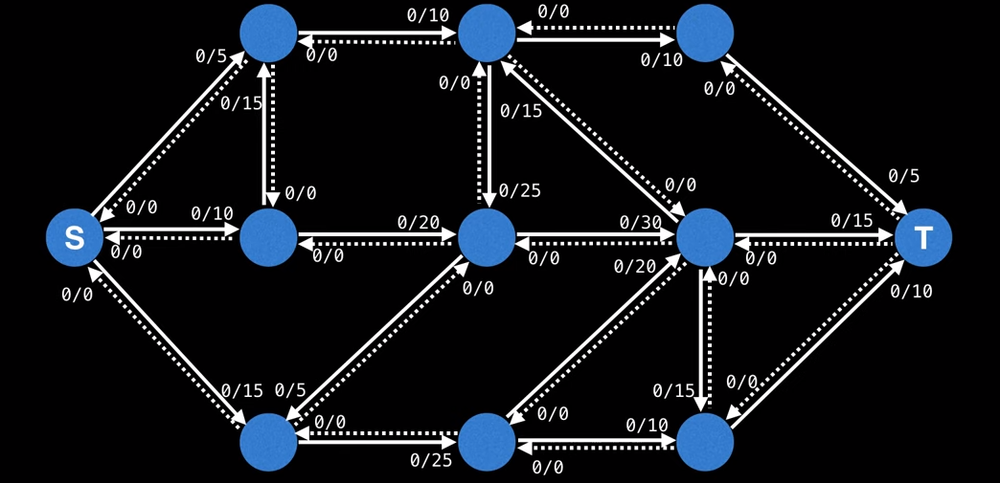
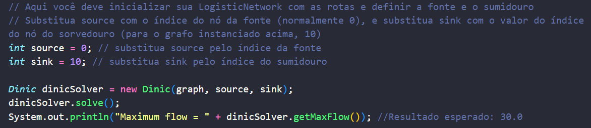
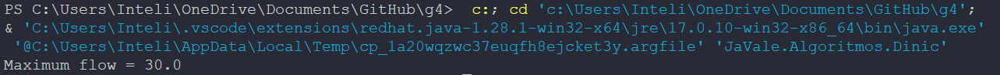

# Introdução

&emsp; O algoritmo de Dinic é um algoritmo de otimização de fluxo máximo, sendo um dos mais fáceis de se implementar, assim como um dos mais rápidos (DINITZ, Yefim, p.1, 2006)uma implementação do algoritmo de Edmond-Karps, que garante uma perfomance melhor do que o seu antecessor. Isso se deve pela implementação da busca por largura, como estratégia de mapeamento dos níveis dos nós, para garantir que o fluxo sempre escoe no sentido positivo na direção do sorvedouro do grafo. Por conta disso, é possível reduzir a complexidade do Edmond-Karps, de $O(VE^2)$, para $O(V^2E)$, onde V (_vertex_) é o número de vértices, e E (_edges_) é o número de arestas (AHUJA, R. K.; ORLIN, James B, p.2, 1987). Essa mudança apresenta um aumento de perfomance porque, na maioria dos grafos, há uma quantidade razoavelmente maior de arestas do que nós, tendo que o mesmo nó pode se conectar a vários outros. 

# Implementação

&emsp; Por meio do código de William Fiset, disponibilizado em sua página do _GitHub_, fomos capazes de adaptar esse modelo para o contexto de dados da Vale. Para validar o seu funcionamento, implementamos um caso de exemplo na classe _main_, o qual pode ser verificado por meio da execução do arquivo "Dinic.java". Na próxima seção, será descrito o caso utilizado, as variáveis envolvidas, o resultado esperado, e o resultado obtido. 

# Resultados 

&emsp; Por conta de problemas técnicos, não foi possível implementar os dados fornecidos pelo parceiro para essa _sprint_. Entretanto, como forma de demonstração do algoritmo criado, foi criado um caso de teste com um grafo reduzido, apresentando 11 vértices. Apesar de ser relativamente pequeno, em comparação à escala da malha logística da Vale, ainda é válido para demonstrar a execução do algoritmo e provar a sua eficiência e precisão na busca do fluxo máximo. 

&emsp; Foi utilizado como métrica o gráfico usado de exemplo em uma vídeo aula disponibilizada no YouTube por William Fiset, o mesmo autor do código fonte usado de referência. Ele pode ser observado na imagem abaixo: 

Figura 01 - Grafo referência para os testes

Fonte: Videoaula de William Fiset (2018)

&emsp; Nesse grafo, temos 11 nós representados, com a fonte sendo representada pela letra S, e o sorvedouro pelo T. Além disso, há 18 arestas diretas, que conectam diferentes nós entre si, com cada uma contendo o valor da sua capacidade. Por meio da adaptação ao código implementado, foi possível representar esse grafo pelo código, e calcular o seu fluxo pelo algoritmo. Como conteúdo da videoaula, o fluxo máximo desse grafo é calculado manualmente, sendo este valor de 30. 

&emsp; Assim, temos como resultado esperado o valor 30. Abaixo, podemos verificar a implementação do teste na classe _main_, além do  valor retornado ao executar o código "Dinic.java": 

Figura 02 - Parte da construção do teste na classe _main_ do código do algoritmo

Fonte: autoria própria (2024)

Figura 03 - Resultado da execução do teste

Fonte: autoria própria (2024)

&emsp; Portanto, pode-se concluir que a implementação do algoritmo para o contexto dos dados da Vale foi um sucesso. Com esse teste, percebemos que o resultado obtido foi o mesmo que o resultado esperado. Para a próxima _sprint_, implementaremos casos mais robustos, para dar um maior embasamento à eficiência e precisão do algoritmo desenvolvido.

# Referências

FISET, William. 2018. Dinic's Algorithm | Network Flow | Graph Theory. 1 vídeo (12 min). Disponível em: https://www.youtube.com/watch?v=M6cm8UeeziI. Acesso em: 15/03/2024.

FISET, William. 2018. Dinic's Algorithm | Network Flow | Source Code. 1 vídeo (10 min). Disponível em: https://www.youtube.com/watch?v=_SdF4KK_dyM. Acesso em: 15/03/2024.

FISET, William. 2018. Algorithm. GitHub. Disponível em: https://github.com/williamfiset/Algorithms/tree/master/src/main/java/com/williamfiset/algorithms/graphtheory/networkflow. Acesso em: 15/03/2024.

AHUJA, R. K.; ORLIN, James B. 1987. "A FAST AND SIMPLE ALGORITHM FOR THE MAXIMUM FLOW PROBLEM". Acesso em: 15/03/2024.

DINITZ, Yefim. 2006. "Dinitz’ Algorithm: The Original Version and Even’s Version". Acesso em: 15/03/2024. Acesso em: 15/03/2024.